# Geospatial Predictive Analytics and Decision Support Tool for Crime Analysis

##### <mark>Submitted by: Abhay R. Vittal, Group 15, CS4365, 29 July 2026</mark>

## 

## Table of Contents

1. **Abstract**

2. **Introduction** **and Background Context**
   
   1. Background and Objectives
   2. Literature Review on Theories of Crime and Neighborhoods
   3.  Literature Review on Geospatial Methdologies
   4. Project Plan and Deliverables

3. **Building the dataset**
   
   1. Data Sources
   2. Data Cleaning
   3. Geospatial data pre-processing 

4. **Exploratory Data Analysis** 
   
   1. Crime Counts and Rates (Bar Charts)
   2. Temporal trends (Time based Box Plots)
   3. Types of family and non family crimes (Bar Charts)
   4. Maps of crime rates 

5. **Geospatial Data Mining** 
   
   1. Measures of global spatial autocorrelation (Moran's-I)
   2. Local Hot Spot Analysis (LISA)
   3. Spatial Machine Learning based Clustering (SKATER)

6. **Geospatial Regression**
   
   1. Spatial Lag / Autoregressive models (SAR)
   2. Spatial Error Models (SEM)

7. **Scenario Analysis**
   
   1. Scenario 1 : Economic Growth and Crime Rates
   2. Scenario 2 : Economic Recession and Crime Rates

8. **Conclusions** **and Execution Instructions**

9. **References**

10. **Appendix 1 : Python Code Listing**
    
    1. Data Ingestion (cp2_data_retrieval.py)
    
    2. Data Merging and Preprocessing (cp2_merge_data.py)
    
    3. Exploratory Data Analysis (cp2_eda.py)
    
    4. Spatial Data Analysis (cp2_esda.py)
    
    5. Spatial Data Mining : Moran's-I, LISA & SKATER (cp3_spatial_ml.py)
    
    6. Spatial Regression (cp3_spatial_reg.py)
    
    7. Scenario Analysis (cp4_scenarios.py)
    
    8. Execution Instructions

11. **Appendix 2 : Spatial Regression Model Details and Diagnostics**
    
    1. Spatial Autoregressive Model, Family Violence
    2. Spatial Autoregressive Model, Non-Family Violence
    3. Spatial Error Model, Family Violence
    4. Spatial Error Model, Non-Family Violence

_______________________________________

## Part 1 - Abstract

This technical report summarizes work done on my project on **Geospatial Analytics for Austin Crime data**, as part of my final project in CS4365 (Enterprise Computing). The goal of this activity was to develop a Python-based decision support tool for police and policy makers to help them understand the relationships between neighborhood crime patterns in Austin, TX, socio-economic status (SES) data and economic cycles. This tool is developed in the context of established socioeconomic theories of crime and neighborhood effects. This project includes an end-to-end workflow comprising of Python code for accessing geospatial data (GeoJSON) for the Austin area, combining it with different geospatial datasets (US census). It then conducts a variety of analyses including exploratory data analysis, Tests for global spatial autocorrelation (Moran's-I), local hot spot analysis (LISA) and Machine-Learning based spatial clustering (SKATER). The code then performs two types of spatial regression analyses including Spatial Autoregressive (SAR) and Spatial Error Models (SEM), with the goal of predicting crime rates per census block from SES variables. Finally, the code predicts neighborhood crime patterns for different economic scenarios, making this a complete analytics and decision support tool.

__________________________________________________

## Part 2 - Introduction and Background Context

Police departments in large and small cities alike lack sophisticated data analytics tools that provide actionable insights. Crime data portals by nature are mostly descriptive and spatial analysis is mostly restricted to mapping. Under-resourced police departments have very fragmented databases and lack the insight and technical support to pull these datasets together to derive insights. This gap provides an opportunity to create integrated data analysis architecture to improve public safety and inform effective policing strategies. 

#### 2.1 Literature Review on Theories of Crime and Neighborhoods

A primary debate within the criminology literature surrounds the relative importance of physical signs of neighborhood disorder versus less visible signs of social disorder. The Broken Window Hypothesis is a social theory which states that crime is associated with a high degree of neighborhood disorder (Lanfear et al, 2020; Miceli & Segerson, 2024). Broken window policing is based on the premise that focusing on preventing low-level crimes deters more serious crimes without addressing the underlying social mechanisms that give rise to crime in the first place (Gau & Pratt, 2010). 

In addition, there are two related theories (Agnew, 1992) that specifically explain family and non-family violence in terms of SES variables. For example, SES patterns related to neighborhood disadvantage, employment status is related to **General Strain Theory** (GST) and often used to explain non-family violence. On the other hand, other SES patterns related to household distress and low education levels are related to **Social Disorganization Theory** (SDT) which is more strongly related to family violence. The analyses in this report provide additional empirical evidence that these theories apply to the Austin crime dataset as well.

This creates a conundrum for law enforcement and local government with respect to where their efforts need to be prioritized - Should crime reduction policies mostly address minor crimes associated with only visible, physical signs of disorder or should strategies focus on the underlying factors that determine the core social cohesiveness of neighborhoods?

#### 2.1 Literature Review on Geospatial Methdologies

Both Spatial Regression and Spatial data Mining are two powerful ways of studying data with a geographic component, specially to uncover hidden spatial patterns that provide insights and make models more accurate. Traditional statistics typically assumes the data points do not impact each other. However, spatial data violates this assumption as data points close to each other geographically are usually very similar – especially when looking at crime maps. Geospatial Regression corrects for this, by including location information (E.g. Spatial Autocorrelation) into the mathematical formulation of the regression models (Anselin, 1988; Chi & Zhu, 2020) - this improves their accuracy and inferential power. Geospatial Cluster Analysis uses special algorithms to group geographic features, isolate localized hot spots and identify unusual features that humans might miss (Han et al., 2012; Miller & Han, 2009). Together, these provide a powerful lens to understand crime patterns.  This project utilizes spatial data science methods to examine patterns of crime in the city of Austin, Texas to reveal areas for strategic intervention and determine the relative significance of socioeconomic vs physical indicators of crime. 

**The final output of this project is a predictive decision support tool** to help the Austin Police Department to make strategic policing decisions including resource allocation, community engagement, and other crimemitigation policies. 

#### 2.3 Project Plan and Deliverables

| Milestone / Date | Deliverables                                  | Description                                                                                                                                                                                         |
|:---------------- |:--------------------------------------------- |:--------------------------------------------------------------------------------------------------------------------------------------------------------------------------------------------------- |
| Checkpoint 1    | Proposal and Project Plan                     | Problem Identification, Literature Review, Theoretical Framework, Analytical & Methodological Approach, Datasets research, Technical Implementation Approach                                        |
| Checkpoint 2    | Merged, Cleaned Dataset + Code                | API access for Data retrieval, including crime data, centers of population data, socioeconomic and demographic data.                                                                                |
| Checkpoint 2    | Exploratory Data Analysis Plots, Code         | Plots of crime rates by type, count and rate; Box plots of crime rates in time, crime type details                                                                                                  |
| Checkpoint 2    | Exploratory Spatial Data Analysis Maps, Code. | Choropleth maps of crime rates by type, socioeconomic variables by category.
| Checkpoint 3    | Code & Spatial Autocorrelation and Hot Spots  | Maps and histograms of global autocorrelation analysis (Moran's-I) andlocal hotspot analysis (LISA)                                                                                                 |
| Checkpoint 3    | Spatial ML-Cluster Maps and Diagnostics, Code | Maps of ML-Based Clustering (SKATER) for crime rates and key socioeconomic variables                                                                                                                |
| Checkpoint 3    | Spatial Regression Models and Maps, Code      | Spatial Statistical Regression (SAR, SES) models to predict crime rates as a function of spatial effects,  and socio-economic variables. Includes model details, predictions, diagnostics and maps. |
| Checkpoint 4    | Scenario Analysis, Project readme, Code, Maps | Results from applying the spatial regression model to future economic growth scenarios (high growth, low growth and status quo) with maps that show their impact on forecasted crime rates.         |

_________________________________________

## Part 3 -  Building the dataset

#### 1.1 Data Sources

The first step was to access data from official sources using an API call to make the analysis reproducible. 2024 crimes data was retrieved from Austin Crime data API.  

Next, centers of population (proxies for latitude and longitude) of each census block group in Austin were retrieved from the Austin Data Portal API.  

Finally, socioeconomic, demographic, and housing characteristics data (SES) at the block group level was obtained from the 2024 US census data API.

The python script that runs this step is given as ```cp2_data_retrieval.py```.

#### 1.2 Data Cleaning

The crime dataset was aggregated by census block group for geospatial data mining and regression. This was done as the finest resolution for which SES data was available which was the block group level.  

Then socioeconomic data was merged with the crime dataset. Crime rates (crimes per 1000 residents) were calculated for all major crime types and it was merged with the combined dataset.  

Finally, the dataset was cleaned by removing columns that were missing a lot of SES data. Overall, minimal imputation was required.

The python script that runs this step is given as ```cp2_merge_data.py```.

#### 1.3 Geospatial data pre-processing

Python's PySAL libraries provide a comprehensive suite of methods for generating maps from GeoJSON shape files. The centroid coordinates for each Block ID are provided from the Austin crime data portal as standard latitute and longitide values, and these are converted into internal standard coordinate systems.

_________________________________________

## Part 4 - Exploratory Data Analysis

The goal of exploratory data mining is to understand and
visualize overall trends, anomalies and patterns in crime pattern data before
establishing hypotheses or conducting detailed statistical analysis and
regression models. Tools include bar charts, box plots, maps and trends lines.

The python scripts that run this step are given as ```cp2_eda.py``` and ```cp2_esda.py```.

The figure below shows an overall breakdown of the top crime categories in the Austin area in 2024.

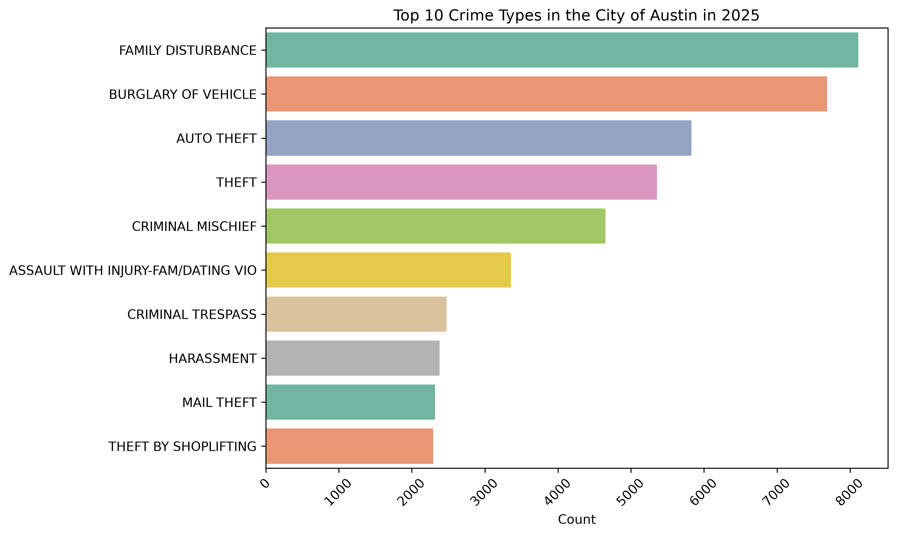

The next chart shows the monthly count of crime events. At this point, it is difficult to see an obvious seasonality effect or any abnormal trends.

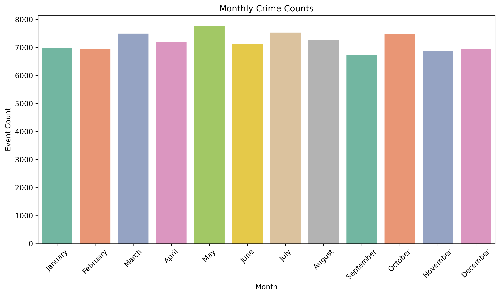

Another way of visualizing temporal effects is by looking at crime events per block, over time. The goal is to see if there are any “outlier” blocks that have very high or low crime events. In this case, there are a set of block ID’s that have consistent high rates (outliers) over all time periods, indicating some spatial effect might exist. 

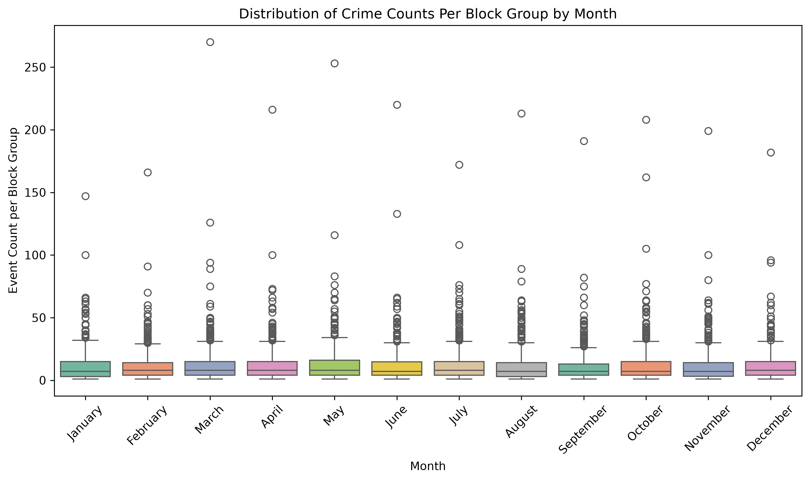

Based on crime theories discussed earlier, and using the standard government crime classification system, the crime types have been aggregated into family violence and non-family violence. The next chart shows the monthly trend of crime events by crime category. 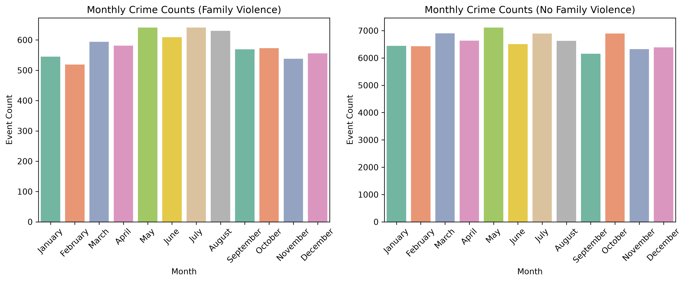

The chart below is a monthlyboxplot where each data point is the crime count by crime type per block ID. There is a clear diffeenc in the outlier patterns across the two categories.

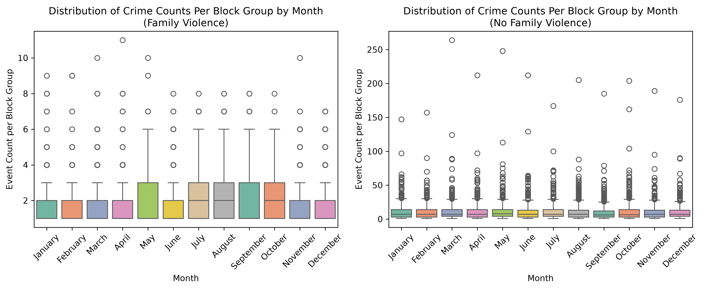

Next, the crime counts per Block ID are plotted on maps. The chart below shows a map of total crime counts, with a few distinct areas of high crime activity. This does not take into account signficant differences in the number of people living in each census block.

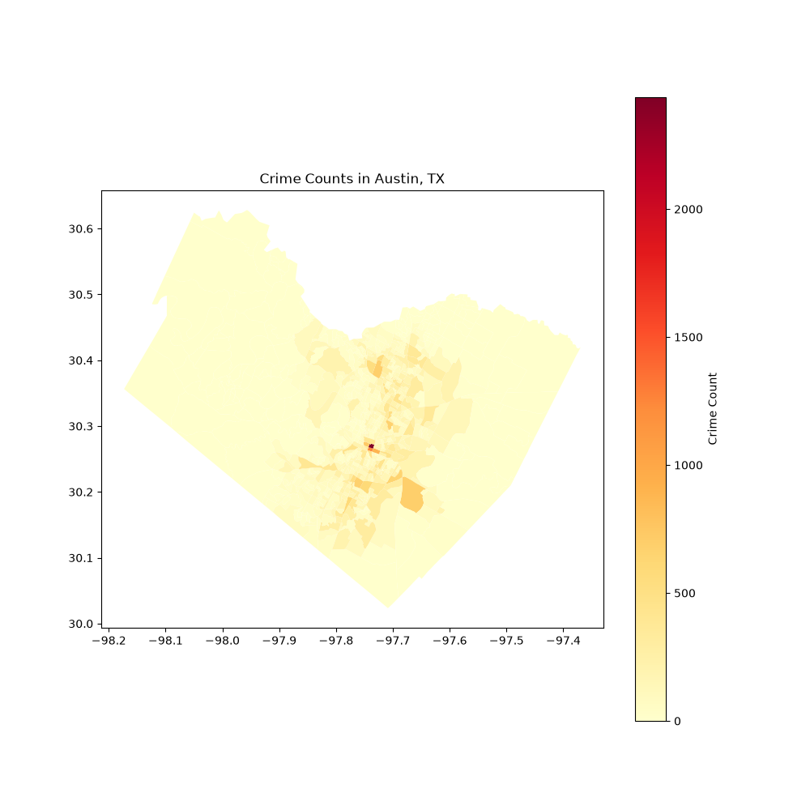

The chart below shows total crime rates, where the crime rate has been normalized by the population in each block. This rate is expressed as crimes per 1000 residents. Here a more nuamced picture emerges, and we see several blocks that have high crime rates.

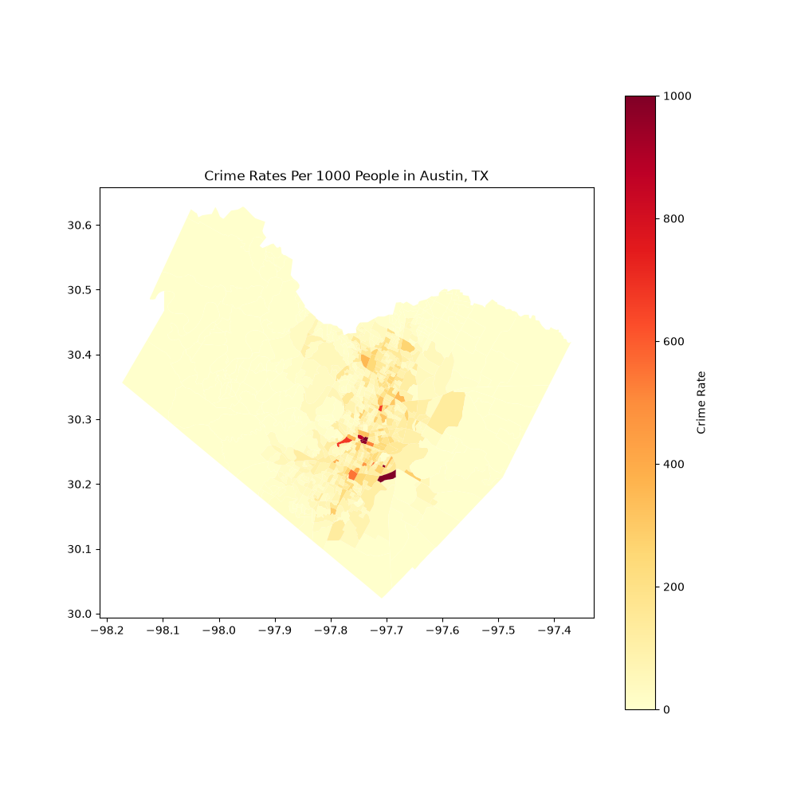

_________________________________________

## Part 5 - Geospatial Data Mining

The goal of geospatial data mining is to generate insights grounded in a statistically rigorous methodology. The hypothesis to be tested includes the presence of global spatial patterns, local hotspots, and the existence of clusters comprising of crime rates along with relevant socioeconomic variables.

The python script that runs this step is given as ```cp3_spatial_ml.py```

### 5.1 Measures of global spatial autocorrelation (Moran's-I)

The “Moran’s I” global test for spatial clustering tests the hypothesis if there is an inherent geospatial pattern in the variables of interest (crime rates) or if that is due to pure chance. There is clear statistical evidence of significant geospatial clustering in crime rates, as seen in the Moran-I scatterplots below for total crime, family violence and nonfamily violence rates. **Note that Moran's test is for crime rates and it's neighbourhood effects only, and does not include effects of other SES variables.**

**Understanding Moran's-I scores**: The score can ragme from -1.0 (perfect disperson) to +1.0 (perfect clustering). The P-value for all cases were significant (below <0.05) rejecting the hypothesis that crime is randomly distributed.

Moran's-I for **total crime** rates ~ 0.36 (moderate-to-strong spatial autocorrelation) 

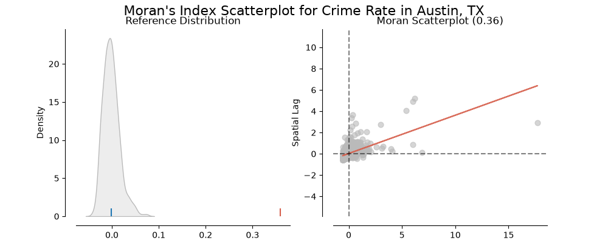

Moran's-I for **family violence** rates ~ 0.35 (moderate-to-strong spatial autocorrelation)

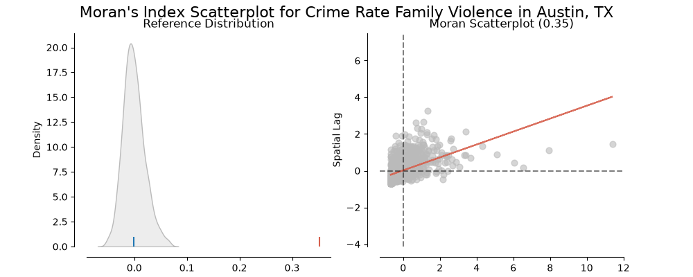

Moran's-I, **Non-family** violence rates ~ 0.36 (moderate-to-strong spatial autocorrelation)

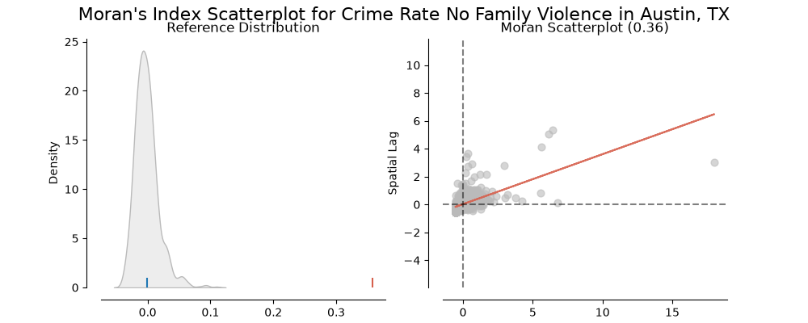

The next step is to look for statistically significant local autocorrelation ("hotspots")

#### Local Hot Spot Analysis (LISA)

The hypothesis that we have “local hotspots” was tested by performing a LISA clustering analysis (**Local Indicators of Spatial Association**). A Local Moran’s I score is calculated for each block group in the city of Austin, and here also, statistically significant clusters are seen that differ by crime types. Some of the theoretical frameworks that this study is based on appear to be substantiated.

The chart below shows the LISA cluster map for total crime rates. HH implies "High-High", where high-crime neighborhoods are surrounded by other similar high-crime neighborhoods ,evidence of the spillover effect. LL are low-crime neighborhoods surrounded by similair low-crime areas. This is mainly in subsurban and rural areas Austin, whereas as a lot of crime is in urban high-population density blocks.

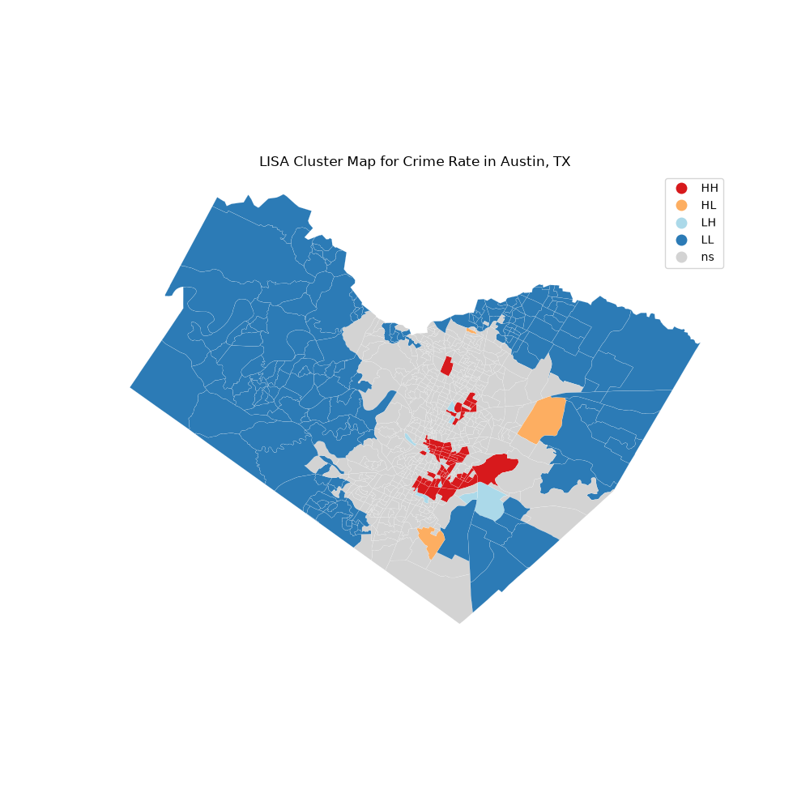

The chart below shows the LISA cluster map for family violence crime rates

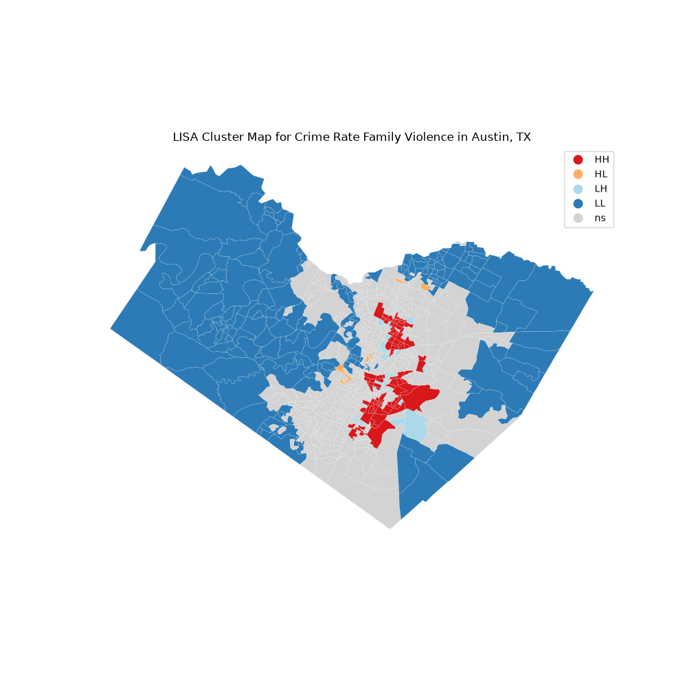

The chart below shows the LISA cluster map for non-family violence crime rates

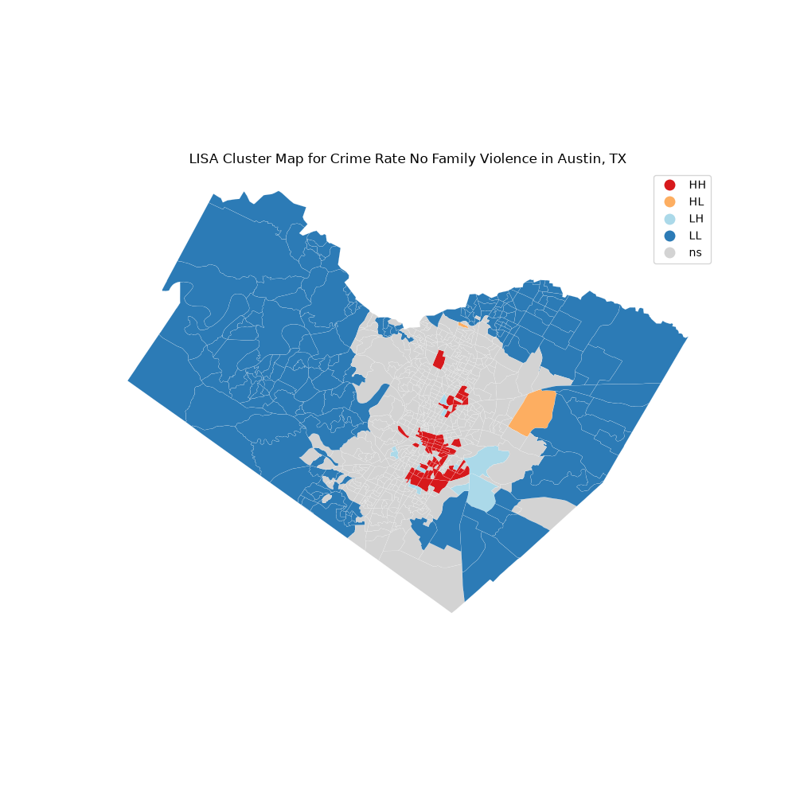

Now that the existence of hot spots is clearly established, the focus is on looking at the coexistence of specific socioeconomic features with crime rates. This requires more advanced machine-learning based spatial clustering methods

#### Spatial ML-Heirarchic Clustering (SKATER)

The next goal was to examine the existence and nature of crime rate spatial clusters ***jointly*** with other socioeconomic variables. One of the more sophisticated geospatial clustering methods is the SKATER algorithm (Spatial K-luster Analysis by Tree Edge Removal) which is based on maximizing similarity by hierarchical spatial graph learning – which is superior to standard machine learning methods that were planned earlier. This was done for total, family and non-family crime rates with additional socioeconomic variables drawn from the larger dataset. Multiple SKATER-based cluster maps were generated for socioeconomic variables based on crime theories. These clusters included a combination of crime rates and their theoretically relevant socioeconomic variables.

The map below shows SKATER-based spatial clusters for **neighborhood disadvantages**. The SES variables include, (1) Percent below Poverty Level, (2) Percent of female-headed households, the percent change in the number of housing units (indicators of housing value change and neighborhood instability) and percent of vacant units. There are clear patterms of high-distress blocks clustered together.

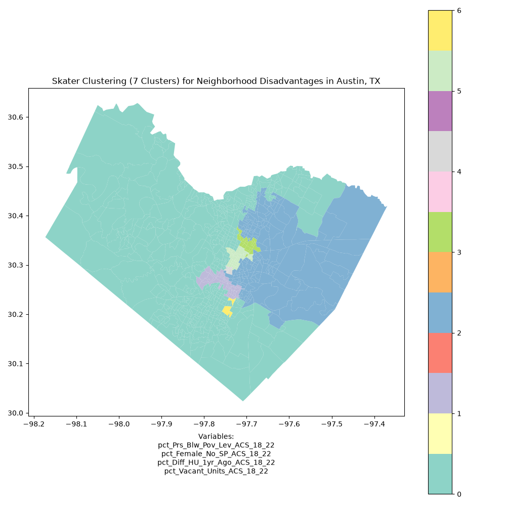

The map below shows SKATER-based spatial clusters for **Interpersonal Stress**. SES variables include percent of residents who have not completed high school, and households with no internet access. Here a larger high-risk pattern is detected that also overlaps with other clusters of distress.

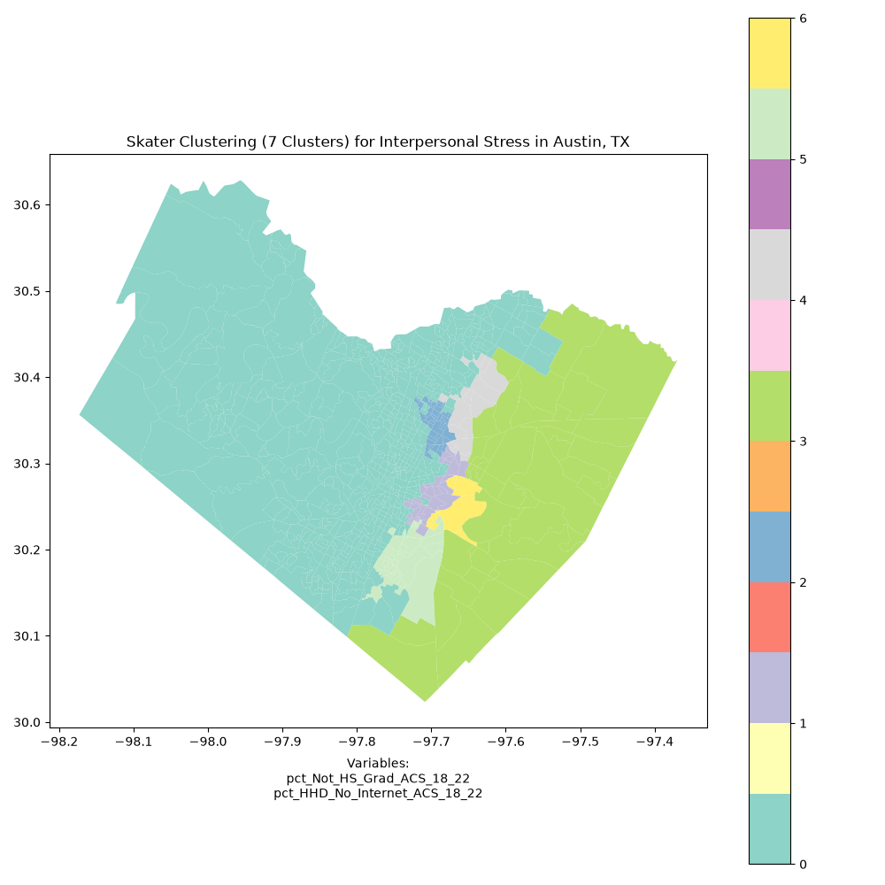

The map below shows SKATER-based spatial clusters for **Economic Strain**. SES variables include (1) Percentage of households receiving public assistance income, and (2) Median Household Income. In general, Austin is a prosperous high-growth area with wealth and financial stability, but we do see small sections in the downtown urban areas with higher levels of economic strain when compared to the rest of the area.

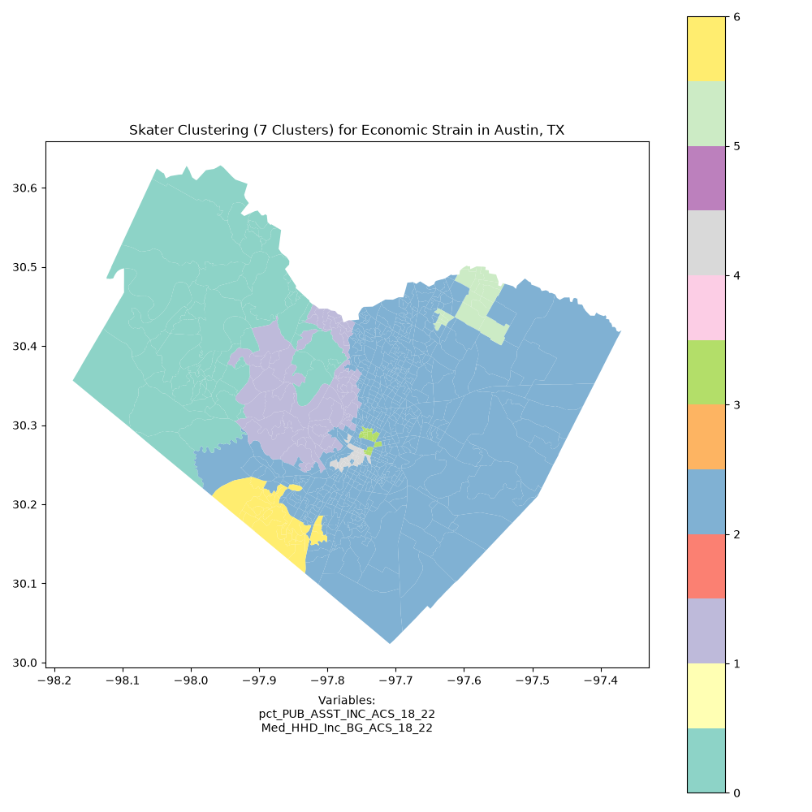

The chart below shows SKATER-based spatial clusters for high-risk **Household Structures**. These are based on SES variables like (1) Percent of non-family housing units, and (2) percentage of crowded occupied housing units. These are markers of high-stress living conditions which are associated with family (domestic) violence.

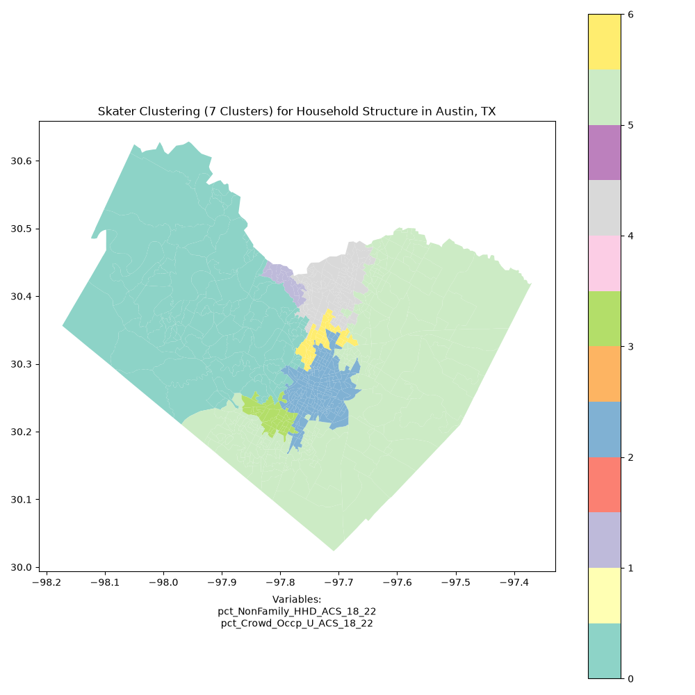

Overall, the SKATER analyses clearly show the existence of high-risk socioeconomic conditions that are clustered in areas that also have high rates of criminal activity. We also see spatial patterns in the SES categories that appear to be associated with the spatial differences in family and non-family violence patterns. So, the conclusion is there are statistically significant neighborhood effects (Moran’s-I) , there are significant hotspots in crime rates, and we have evidence that SES variables could provide some explanation for the residual variance in crime rates beyond spatial effects alone. 

The next step would be to build formal **predictive models that include spatial effects as well as SES variables**. This is done vis **spatial regression**, discussed in the next section.

_________________________________________

## Part 6 : Geospatial Regression

Ordinary Least Squares assumes that data observations are independent, however the Moran's-I score of 0.36 with a significant P-value proves significant spatial dependency exists. **Therefore, spatial modeling methods are needed**.

In this study, both SAR and SEM regression analysis were completed for crime rates by crime type (total, family and non-family) with 10 socioeconomic variables that were important from the earlier spatial clustering analysis. The goal is to predict crime rates as a function of spatial effects and critical SES variables. Note that crime rate is the dependent variable and location (latitude, longitude) and socio-economic variables are independent variables.

**Explanation of SES variables used in regression**

* **`pct_Prs_Blw_Pov_Lev_ACS_18_22`**: Percentage of Persons Below Poverty Level

* **`pct_Female_No_SP_ACS_18_22`**: Percentage of Female-Headed Households with No Spouse Present

* **`pct_Diff_HU_1yr_Ago_ACS_18_22`**: Percentage Difference in Housing Units Compared to 1 Year Ago

* **`pct_Vacant_Units_ACS_18_22`**: Percentage of Vacant Housing Units

* **`pct_PUB_ASST_INC_ACS_18_22`**: Percentage of Households with Public Assistance Income

* **`Med_HHD_Inc_BG_ACS_18_22`**: Median Household Income at the Block Group Level

* **`pct_Not_HS_Grad_ACS_18_22`**: Percentage of the Population (Ages 25+) Not Graduated from High School

* **`pct_HHD_No_Internet_ACS_18_22`**: Percentage of Households with No Internet Subscription

* **`pct_NonFamily_HHD_ACS_18_22`**: Percentage of Non-Family Households

* **`pct_Crowd_Occp_U_ACS_18_22`**: Percentage of Crowded Occupied Housing Units

The python sscript that runs this step is provided as ```cp3_spatial_reg.py```.

### 6.1 Spatial Lag / Autoregressive Models (SAR)

SAR Models add a spatially lagged dependent variable as an explanatory factor, and if that term is statistically significant it proves the importance of geospatial effects . SAR assumes crime in one block directly influences or spills over into neighboring blocks. the rest of the SES variables improve the predictive power of the model, makingit useful for predicting crime rates as SES conditions change.

Model output results for typical SAR case (total crime rates) are shown below. Variables with low P-values indicate they are statistical significant. The Pseudo-Rsq of 36% is typical for social science models. The "Spatial Weights" term (W_crime_rate) is extremely significant, as expected.

The text below shows the SAR (Spatial Lag Model) results for total crime rates.

```text
REGRESSION RESULTS
------------------

SUMMARY OF OUTPUT: MAXIMUM LIKELIHOOD SPATIAL LAG (METHOD = FULL)
------------------------------------------------------------------------------------
Data set            :     unknown
Weights matrix      :     unknown
Dependent Variable  :  crime_rate                Number of Observations:         766
Mean dependent var  :     81.5993                Number of Variables   :          12
S.D. dependent var  :    146.3731                Degrees of Freedom    :         754
Pseudo R-squared    :      0.3589
Spatial Pseudo R-squared:  0.1986
Log likelihood      :  -4760.9546
Sigma-square ML     :  13857.5497                Akaike info criterion :    9545.909
S.E of regression   :    117.7181                Schwarz criterion     :    9601.603

------------------------------------------------------------------------------------
            Variable     Coefficient       Std.Error     z-Statistic     Probability
------------------------------------------------------------------------------------
            CONSTANT       -27.62511        21.34488        -1.29423         0.19559
pct_Prs_Blw_Pov_Lev_ACS_18_22         0.19569         0.34667         0.56447         0.57243
pct_Female_No_SP_ACS_18_22         0.73427         0.48720         1.50710         0.13178
pct_Diff_HU_1yr_Ago_ACS_18_22        -0.21928         0.35081        -0.62508         0.53192
pct_Vacant_Units_ACS_18_22        -0.05651         0.49061        -0.11519         0.90830
pct_PUB_ASST_INC_ACS_18_22        -0.72513         1.24223        -0.58374         0.55940
Med_HHD_Inc_BG_ACS_18_22        -0.00011         0.00010        -1.06385         0.28740
pct_Not_HS_Grad_ACS_18_22         1.16690         0.44844         2.60215         0.00926
pct_HHD_No_Internet_ACS_18_22        -0.22515         0.60424        -0.37261         0.70944
pct_NonFamily_HHD_ACS_18_22         1.46776         0.25698         5.71150         0.00000
pct_Crowd_Occp_U_ACS_18_22        -0.68156         0.69012        -0.98760         0.32335
        W_crime_rate         0.54185         0.04028        13.45132         0.00000
------------------------------------------------------------------------------------

SPATIAL LAG MODEL IMPACTS
Impacts computed using the 'simple' method.
            Variable         Direct        Indirect          Total
pct_Prs_Blw_Pov_Lev_ACS_18_22         0.1957          0.2314          0.4271
pct_Female_No_SP_ACS_18_22         0.7343          0.8684          1.6027
pct_Diff_HU_1yr_Ago_ACS_18_22        -0.2193         -0.2593         -0.4786
pct_Vacant_Units_ACS_18_22        -0.0565         -0.0668         -0.1233
pct_PUB_ASST_INC_ACS_18_22        -0.7251         -0.8576         -1.5827
Med_HHD_Inc_BG_ACS_18_22        -0.0001         -0.0001         -0.0002
pct_Not_HS_Grad_ACS_18_22         1.1669          1.3801          2.5470
pct_HHD_No_Internet_ACS_18_22        -0.2251         -0.2663         -0.4914
pct_NonFamily_HHD_ACS_18_22         1.4678          1.7359          3.2037
pct_Crowd_Occp_U_ACS_18_22        -0.6816         -0.8061         -1.4876
================================ END OF REPORT =====================================

```

The Appendix provides model outputs for other SAR cases for family and non-family violence respectively


### 6.2 Spatial Error models (SEM)

SEM account for spatial autocorrelation in the error term. This assumes that the spatial pattern is caused by unobserved variables missing from your dataset, and that’s detected in the residuals. Here also, the SES variables contrbute to overall model accuracy, reducing the number of "unobserved variables". 

The text below shows the SEM (Spatial Error Model) results for total crime rates. The spatial autoregressive coefficient for the error vector, "lambda", is significant.

```text
Spatial Error Model Summary:
REGRESSION RESULTS
------------------

SUMMARY OF OUTPUT: ML SPATIAL ERROR (METHOD = full)
------------------------------------------------------------------------------------
Data set            :     unknown
Weights matrix      :     unknown
Dependent Variable  :  crime_rate                Number of Observations:         766
Mean dependent var  :     81.5993                Number of Variables   :          11
S.D. dependent var  :    146.3731                Degrees of Freedom    :         755
Pseudo R-squared    :      0.1781
Log likelihood      :  -4762.8981
Sigma-square ML     :  13783.0571                Akaike info criterion :    9547.796
S.E of regression   :    117.4013                Schwarz criterion     :    9598.849

------------------------------------------------------------------------------------
            Variable     Coefficient       Std.Error     z-Statistic     Probability
------------------------------------------------------------------------------------
            CONSTANT        10.61269        23.70034         0.44779         0.65431
pct_Prs_Blw_Pov_Lev_ACS_18_22         0.52400         0.39176         1.33758         0.18103
pct_Female_No_SP_ACS_18_22         0.81001         0.49069         1.65077         0.09879
pct_Diff_HU_1yr_Ago_ACS_18_22        -0.19543         0.35217        -0.55494         0.57894
pct_Vacant_Units_ACS_18_22         0.04345         0.49653         0.08751         0.93026
pct_PUB_ASST_INC_ACS_18_22        -0.90681         1.20687        -0.75138         0.45243
Med_HHD_Inc_BG_ACS_18_22        -0.00020         0.00011        -1.84652         0.06482
pct_Not_HS_Grad_ACS_18_22         1.09186         0.47118         2.31726         0.02049
pct_HHD_No_Internet_ACS_18_22        -0.14515         0.60871        -0.23846         0.81153
pct_NonFamily_HHD_ACS_18_22         1.57920         0.29145         5.41841         0.00000
pct_Crowd_Occp_U_ACS_18_22        -0.45519         0.68108        -0.66833         0.50393
              lambda         0.58317         0.04106        14.20168         0.00000
------------------------------------------------------------------------------------
================================ END OF REPORT =====================================

```

Here also, the Appendix provides model outputs for other SEM cases for family and non-family violence respectively

**Comparitive maps (SAR, SEM) of crime rate predictions for total crime rates**

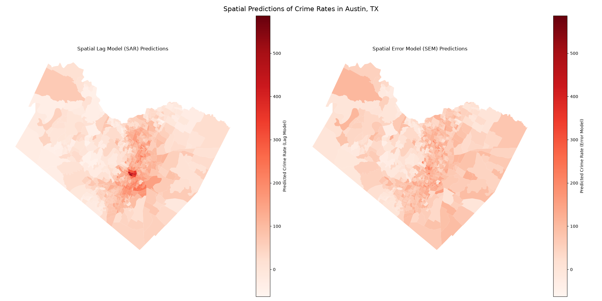

**Comparitive maps (SAR, SEM) of crime rate predictions for family violence**

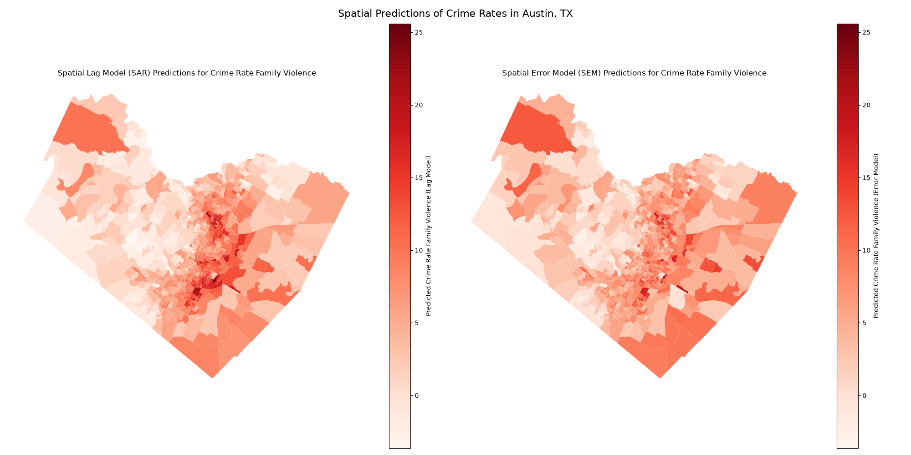

**Comparitive maps (SAR, SEM) of crime rate predictions for non-family violence**

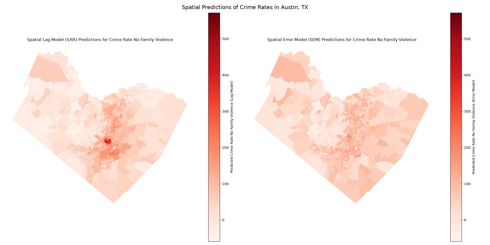

**Both model types show very high statistical significance** for the “neighborhood” impact., i.e. the models confirm a very strong geospatial effect on crime, and this effect needs to be included for understanding and forecasting crime rate patterns. Both models also showed that many of the variables identified by the relevant theories were also statistically significant for the data in Austin.

In general, SAR models are preferred when the dependent variable (crime rates) in one location causes or influences the dependent variable in neighboring locations (**"the sipllover effect"**). This is why SAR models were developed for forecasting crime rates and their patterns under different economic scenarios.

_________________________________________

## Part 7 : Scenario Analysis

In this analysis, the current (2024) socioeconomic dataset is assumed to the reference “base case” . Literature surveys were conducted to generate realistic assumptions for a “good case” (economic expansion growth cycle) and “bad case” (low growth or economic depression).

From the literature review, during economic growth cycle real median household incomes typically rise by 1.0%-4.5% per year (Dalakat 2026, Gould 2024), and poverty rates decline by ~ 0.86% per year (Winship, 2020). Growth cycles typically last 5.5 to 6 years. During a typical recession, real median household incomes drop by 0.7% to 4.2% per year and poverty rates increase by 0.5%-1.1% per year (Shierholz, 2009).

The two variables included for generating economic scenarios are real median household income and poverty rate. These variables are also part of the variables included in the SAR model for total, family and non-family crime rates. Eight other critical SES variables were selected based on results from cluster analysis as well as from domain insights (General Strain Theory and Social Disorganization Theory)

The python script that runs this step is given as ```cp4_scenarios.py```

### 7.1 Scenario 1 : *Economic Growth* and Crime Rates

For this scenario, median household income (measured in dollars) was increased by 3% and poverty rate (in percent) was reduced (subtractive) by 2.5%. 

Three SAR models were developed to predict crime rates (total, family and non-family) as a function of spatial effects and the ten selected SES variables. 

### 7.2 Scenario 2 : *Economic Recession* and Crime Rates

For this scenario, median household income (measured in dollars) was decreased by 3% and poverty rate (in percent) was increased (additive) by 2.5%. 

Like the earlier scenario, three SAR models were developed to predict crime rates (total, family and non-family) as a function of spatial effects and the ten selected SES variables.

**Maps of total crime rate predictions for the two scenarios**

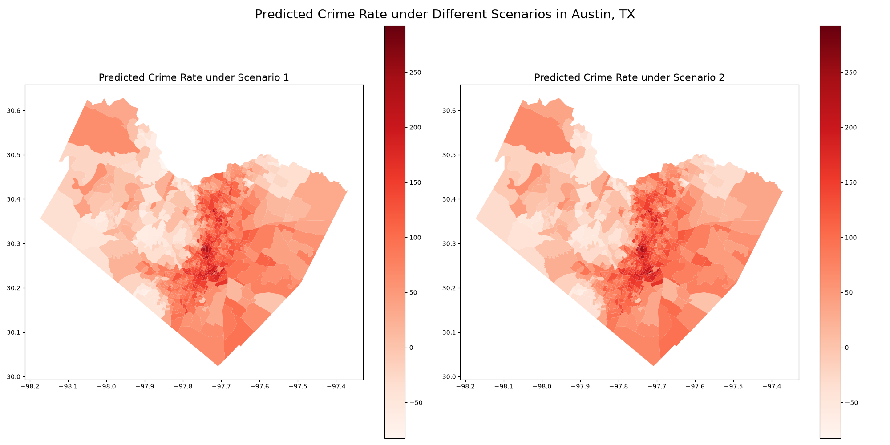

**Maps of family violence rate predictions for the two scenarios**

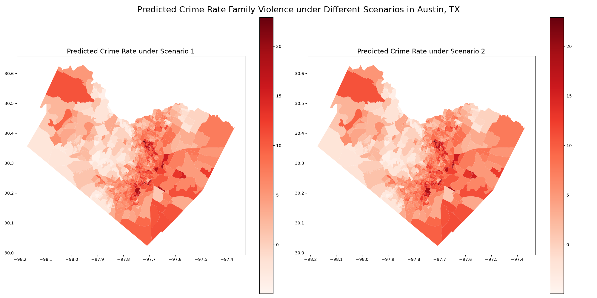

**Maps of non-family violence rate predictions for the two scenarios**

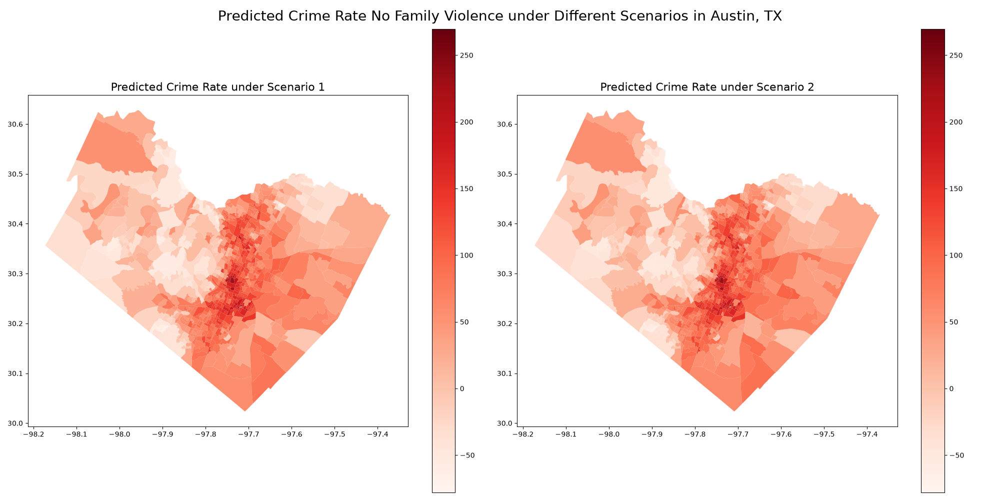

**Note :** At a first glance, it appears that the maps ppear similair and that's mainly due to the scaling used in the maps. The two variables that we chose were correlated with economic activity bit not as stringly as other variables like "Percentage of Non-Family Households" and "Percentage of the Population (Ages 25+) Not Graduated from High School" which were the most significant statistically. 

The "difference" maps below indicate that the models are able to capture subtle differences in the two scenario's

**Maps of differences in total crime rates across the two scenarios**


**Maps of differences in family violence rate rates across the two scenarios**

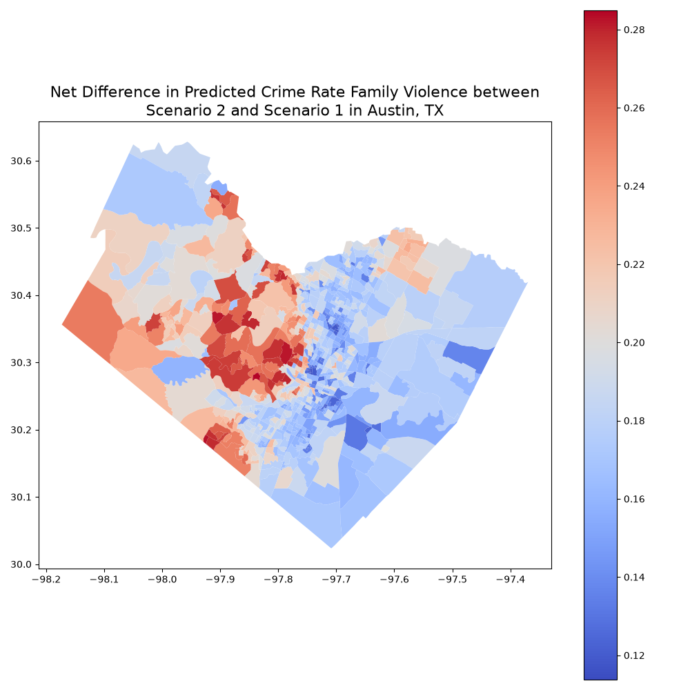

**Maps of differences in non-family violence rates across the two scenarios**

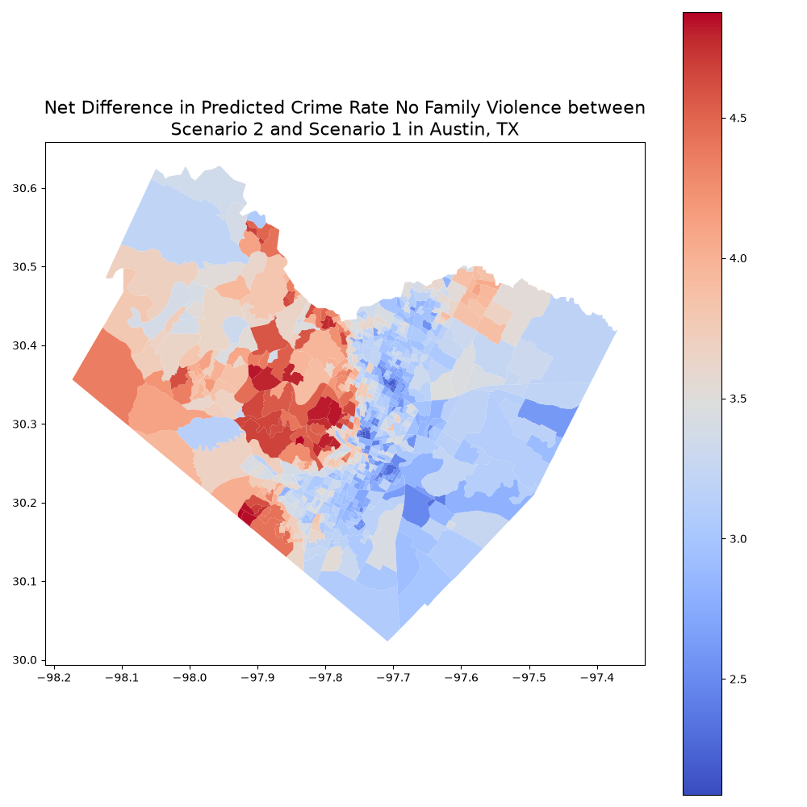


_________________________________________

## Part 8 : Conclusions and Execution Instructions

A complete geospatial analytics workflow has been completed using Python libraries. This starts with code for data acquisition, cleaning and merging; followed by data cleaning and formatting into geospatial formats. There are scalable python functions for exploratory data analysis, spatial data mining (Moram’s-I, LISA, SLATER) as well as spatial regression (SAR, SEM). Code has been written for simulating scenarios and generating maps with supporting diagnostics for decision support. 

This code has been tested on data for analyzing crime in Austin TX , however it is generic in nature and with small modifications the code can be used for other geographical areas, as potentially for non-crime use cases as well (E.g. Health Impact and SES variables)

Specific to the Austin case study, a few items need to be noted. The SKATER analysis of SES variables confirms that many of the crime theories considered are applicable to Austin, TX. Following standard processes described in the literature, the two economic scenarios were implemented by modifying SES variables related to poverty and median income. The difference maps do indicate the impact of economic scenarios on crime rates by neighborhood. However, the most important variables impacting crime were low-education neighborhoods with non-family households. Future research needs to focus on the impact of economic growth and recessions on these two SES variables in addition to pure economic impacts.

I have gained a whole new set of skills while completing this project like linking socioeconomic theory with advanced spatial data analytics concepts; to building efficient, scalable open-source decision support tools. These skills are transferable to many enterprise computing use cases, making this a very valuable learning experience.

This is the complete set of python script files to be executed in order, as well as the datasets, plots, maps, and ML outputs they produce:

File Name | Description | Outputs
|:--|:--|:--|
cp2_data_retrieval.py | Retrieves data from Austin Data Portal and US Census Data Portal APIs. | data/crime_data_2024.csv <br> data/block_spatial_data.csv <br> data/census_data.csv <br> data/block_spatial_data.geojson
cp2_merge_data.py | Joins and aggregates data into block group-level full datasets | data/merged_data.csv <br> data/agg_crime_data.csv <br> data/merged_agg_data.csv 
cp2_eda.py | Conducts exploratory data analysis | plots/monthly_counts.png <br> plots/monthly_counts_separated.png <br> plots/monthly_block_counts.png  <br> plots/monthly_block_counts_separated.png <br> plots/top_10_crimes.png
cp2_esda.png | Conducts exploratory spatial data analysis | data/merged_geo_data.geojson <br> maps/crime_counts_map.png <br> maps/crime_rates_map.png <br> maps/economic_strain_map.png <br> maps/household_structure_map.png <br> maps/interpersonal_stress_map.png <br> maps/neighborhood_disadvantages_map_1.png <br> maps/neighborhood_disadvantages_map_2.png
cp3_spatial_ml.py | Conducts spatial clustering algorithms | plots/morans_I_scatterplot_crime_rate.png <br> plots/morans_I_scatterplot_crime_rate_no_family_violence.png <br> plots/morans_I_scatterplot_crime_rate_family_violence.png <br> maps/lisa_cluster_map_crime_rate.png <br> maps/lisa_cluster_map_crime_rate_no_family_violence.png <br> maps/lisa_cluster_map_crime_rate_family_violence.png <br> maps/skater_clustering_economic_strain.png <br> maps/skater_clustering_household_structure.png <br> maps/skater_clustering_interpersonal_stress.png <br> maps/skater_clustering_neighborhood_disadvantages.png <br> maps/skater_clustering_crime_comparisons.png <br> results/spatial_ml_output.txt
cp3_spatial_reg.py | Conduct spatial regression algorithms | maps/spatial_predictions.png <br> maps/spatial_predictions_crime_rate_no_family_violence.png <br> maps/spatial_predictions_crime_rate_family_violence.png <br> results/spatial_ml_output.txt <br> results/spatial_models_crime_rate.pkl <br> results/separated_spatial_models.pkl
cp4_scenarios.py | Makes predictions based on economic scenarios | maps/predicted_crime_rate_scenarios.png <br> maps/predicted_crime_rate_no_family_violence_scenarios.png <br> maps/predicted_crime_rate_family_violence_scenarios.png <br> maps/predicted_crime_rate_net_difference.png <br> maps/predicted_crime_rate_no_family_violence_net_difference.png <br> maps/predicted_crime_rate_family_violence_net_difference.png

_________________________________________

## Part 9 - References

* Agnew, R. (1992). Foundation for a general strain theory of crime & delinquency. Criminology, 30(1), 47–88
* Anselin, L. (1988). Spatial econometrics: Methods and models. Kluwer Academic Publishers.
* Anselin, L. (1995). Local Indicators of Spatial Association—LISA. Geographical Analysis, 27(2), 93–115.
* Assunção, R. M., Neves, M. C., Câmara, G., & da Costa Freitas, C. (2006). *Efficient regionalization techniques for socio-economic geographical units using minimum spanning trees*. International Journal of Geographical Information Science, 20(7), 797–811.
* Chi, G., & Zhu, J. (2020). Spatial regression models for the social sciences. SAGE Publications.
* Merton, R. K. (1938). Social structure and anomie. American Sociological Review, 3(5), 672–682
* Dalaker, J. (2026, February 11). *Poverty in the United States in 2024 (CRS Report No. R48854)*. Congressional Research Service. https://www.congress.gov/crs-product/R48854
* Gau, J. M., & Pratt, T. C. (2010). *Revisiting broken windows theory: Examining the sources of the discriminant validity of perceived disorder and crime*. Journal of Criminal Justice, 38(4), 758–766. https://doi.org/10.1016/j.jcrimjus.2010.05.002
* Gould, E., & Bivens, J. (2024, September 10). *Real median household income rose sharply in 2023—a testament to the strength of the economic recovery*. Economic Policy Institute. https://www.epi.org/blog/real-median-household-income-rose-sharply-in-2023-a-testament-to-the-strength-of-the-economic-recovery
* Han, J., Kamber, M., & Pei, J. (2012). Data mining: Concepts and techniques (3rd ed.). Morgan Kaufmann
* Hoynes, H., Page, M., & Stevens, A. H. (2006). *The connection between poverty and the economy*. Federal Reserve Bank of Minneapolis (https://www.minneapolisfed.org/article/2006/the-connection-between-poverty-and-the-economy)
* Lanfear, C. C., Matsueda, R. L., & Beach, L. R. (2020). *Broken Windows, Informal Social Control, and Crime: Assessing Causality in Empirical Studies.* Annual review of criminology, 3, 97–120. https://doi.org/10.1146/annurev-criminol-011419-041541
* Miceli, T. J., & Segerson, K. (2024). *The broken-windows theory of crime: A Bayesian approach*. International Review of Law and Economics, 80, Article 106233. https://doi.org/10.1016/j.irle.2024.106233
* Mishel, L., & Bernstein, J. (2001, November 14). *What happens to family income in a recession?* Economic Policy Institute, https://www.epi.org/publication/webfeatures_snapshots_archive_11072001/
* Miller, H. J., & Han, J. (Eds.). (2009). Geographic data mining and knowledge discovery (2nd ed.). CRC Press.  
* Moran, P. A. P. (1950). *Notes on continuous stochastic phenomena*. Biometrika, 37(1/2), 17–23.
* Shierholz, H. (2009, September 10). *New 2008 poverty, income data reveal only tip of the recession iceberg*. Economic Policy Institute. https://www.epi.org/publication/income_picture_20090910/
* Shaw, C. R., & McKay, H. D. (1942).* Juvenile delinquency and urban areas*. University of Chicago Press.
* Winship, S. (2020, September 17). *Poverty in the US reached historic lows prior to the pandemic*. American Enterprise Institute. https://www.aei.org/opportunity-social-mobility/poverty-in-the-us-reached-historic-lows-prior-to-the-pandemic/

_______________________________________

## Part 10 - Appendix - Python Code Listing

### 10.1 Python Code (cp2_data_retrieval.py) for Data Retrieval

* This code block gets spatial data as a GeoJSON file for Austin via an API call

* It gets census data from the government via a API key, for the three counties comprising the Austin metro area

* It sets up dedicated directories and converts some of the data into CSV files

```python
def get_block_spatial_data():
    """
    Retrieve block spatial data for Austin.
    """
    payload = {
        "query": "SELECT geoid, intptlat, intptlon, mtfcc, statefp WHERE countyfp IN ('453')"
    }
    load_dotenv()
    api_key = os.getenv("SOCRATA_API_KEY")
    headers = {
        "Content-Type": "application/json",
        "X-App-Token": api_key
    }
    response = requests.post(BLOCK_SPATIAL_DATA_URL, data=json.dumps(payload), headers=headers)
    if response.status_code == 200:
        return pd.DataFrame(response.json())
    else:
        raise ValueError(f"Failed to retrieve block spatial data: {response.status_code} - {response.text}")

def get_census_data():
    """
    Retrieve census data for Austin.
    """
    load_dotenv()
    api_key = os.getenv("CENSUS_API_KEY")
    columns = ["GEO_ID","GIDBG","State","County","County_name","Tract","LAND_AREA","Tot_Population_ACS_18_22","Median_Age_ACS_18_22","pct_Not_HS_Grad_ACS_18_22","pct_College_ACS_18_22","pct_Prs_Blw_Pov_Lev_ACS_18_22","pct_No_Health_Ins_ACS_18_22","pct_Diff_HU_1yr_Ago_ACS_18_22","pct_Pop_NoCompDevic_ACS_18_22","pct_HHD_No_Internet_ACS_18_22","pct_NonFamily_HHD_ACS_18_22","pct_Female_No_SP_ACS_18_22","pct_PUB_ASST_INC_ACS_18_22","Med_HHD_Inc_BG_ACS_18_22","pct_Vacant_Units_ACS_18_22","pct_Renter_Occp_HU_ACS_18_22","pct_Single_Unit_ACS_18_22","pct_MLT_U2_9_STRC_ACS_18_22","pct_MLT_U10p_ACS_18_22","pct_Mobile_Homes_ACS_18_22","pct_Crowd_Occp_U_ACS_18_22","pct_Recent_Built_HU_ACS_18_22"]
    geography = ["state:48", "county:453,491,209", "tract:*"]
    full_url = f"https://api.census.gov/data/2024/pdb/blockgroup?get={','.join(columns)}&for=block%20group:*&in={'&in='.join(geography)}&key={api_key}"

    response = requests.get(full_url)
    if response.status_code == 200:
        return pd.DataFrame(response.json())
    else:
        raise ValueError(f"Failed to retrieve census data: {response.status_code} - {response.text}")

def get_block_geojson():
    load_dotenv()
    api_key = os.getenv("SOCRATA_API_KEY")
    payload = {
        "query": "SELECT * WHERE countyfp IN ('453')"
    }
    headers = {
        "Content-Type": "application/json",
        "X-App-Token": api_key
    }
    response = requests.post(BLOCK_GEOJSON_URL, data=json.dumps(payload), headers=headers)
    if response.status_code == 200:
        return response.json()
    else:
        raise ValueError(f"Failed to retrieve block geojson: {response.status_code} - {response.text}")

def main():
    setup_directories()
    df = get_crime_data()
    df.to_csv("temp/crime_data_2024.csv", index=False)
    df = get_block_spatial_data()
    df.to_csv("temp/block_spatial_data.csv", index=False)
    df = get_census_data()
    df.to_csv("temp/census_data.csv", index=False)
    geo_data = get_block_geojson()
    with open("temp/block_spatial_data.geojson", "w") as f:
        json.dump(geo_data, f, indent=2)
if __name__ == "__main__":
    main()    
```

### 10.2 Python Code for Merging Data

* All the queried CSV files are read into pandas dataframes

* Columns containing extraenous information is dropped from the dataframe

* Distinct crime counts are aggregated into family and non-family categories based on standard government / FBI classification guidelines

* Crime count datasets are then merged with socioeconomic data by Block ID

```python
import pandas as pd


def load_preprocess_all_queried_data():
    """
    Load and preprocess all queried data from csv files.
    """
    crime_df = pd.read_csv("temp/crime_data_2024.csv")
    block_spatial_df = pd.read_csv("temp/block_spatial_data.csv")
    census_df = pd.read_csv("temp/census_data.csv")

    crime_df.drop(columns=[":id", ":version", ":created_at", ":updated_at"], inplace=True)
    block_spatial_df.drop(columns=[":id", ":version", ":created_at", ":updated_at"], inplace=True)

    crime_df["geoid"] = pd.to_numeric('48' + crime_df["census_block_group"].astype(str), errors='coerce')

    census_df.columns = census_df.iloc[0]
    census_df = census_df.iloc[1:].reset_index(drop=True)
    census_df["GIDBG"] = pd.to_numeric(census_df["GIDBG"], errors='coerce')
    all_dfs = {"crime_df": crime_df, "block_spatial_df": block_spatial_df, "census_df": census_df}
    return all_dfs


def agg_crimes_by_block_group_and_family_violence(df):
    """
    Aggregate crimes by block group.
    """
    result = df.pivot_table(index="geoid", columns="family_violence", aggfunc="size", fill_value=0)
    result.columns = ["No Family Violence", "Family Violence"]
    result = result.reset_index().rename(columns={"geoid": "geoid"})
    result["geoid"] = result["geoid"].astype(int)
    result["No Family Violence"] = pd.to_numeric(result["No Family Violence"], errors='coerce').fillna(0)
    result["Family Violence"] = pd.to_numeric(result["Family Violence"], errors='coerce').fillna(0)
    result["crime_count"] = result["No Family Violence"] + result["Family Violence"]
    return result

def join_agg_crimes_spatial_socioeconomic(agg_crime_df, block_spatial_df, census_df):
    # Join the aggregated crime data with spatial and socioeconomic data
    # merged_df = pd.merge(block_spatial_df, census_df, left_on="geoid", right_on="GIDBG", how="left")
    # merged_df = pd.merge(merged_df, agg_crime_df, on="geoid", how="left")
    merged_df = pd.merge(block_spatial_df, agg_crime_df, on="geoid", how="left")
    merged_df["No Family Violence"] = merged_df["No Family Violence"].fillna(0)
    merged_df["Family Violence"] = merged_df["Family Violence"].fillna(0)
    merged_df["crime_count"] = merged_df["crime_count"].fillna(0)
    merged_df = pd.merge(merged_df, census_df, left_on="geoid", right_on="GIDBG", how="left")
    return merged_df

def join_all_data(all_dfs):
    # Load the data
    crime_df = all_dfs["crime_df"]
    block_spatial_df = all_dfs["block_spatial_df"]
    census_df = all_dfs["census_df"]

    # Join the data
    merged_df = pd.merge(crime_df, block_spatial_df, on="geoid", how="left")
    merged_df = pd.merge(merged_df, census_df, left_on="geoid", right_on="GIDBG", how="left")

    # Save the merged data
    return merged_df

def main():
    all_dfs = load_preprocess_all_queried_data()

    merged_df = join_all_data(all_dfs)
    merged_df.to_csv("temp/merged_data.csv", index=False)

    crime_df = all_dfs["crime_df"]
    agg_crime_df = agg_crimes_by_block_group_and_family_violence(crime_df)
    agg_crime_df.to_csv("temp/agg_crime_data.csv", index=False)

    merged_agg_df = join_agg_crimes_spatial_socioeconomic(agg_crime_df, all_dfs["block_spatial_df"], all_dfs["census_df"])
    merged_agg_df.to_csv("temp/merged_agg_data.csv", index=False)

if __name__ == "__main__":
    main()
```

### 10.3 Python code, Exploratory Data Analysis (cp2_merge_data.py)

* The data is plotted in a variety of ways, including
  
  * barplot for top 10 types of crimes by count
  
  * Plot of monthly crime counts (total, family and non-family)
  
  * Box Plots of Block ID-lvel crime counts by month and type (total, family and non-family)

```python
import pandas as pd
import matplotlib.pyplot as plt
import seaborn as sns

def load_merged_data_with_months():
    data = pd.read_csv("temp/merged_data.csv")
    data['date_time'] = pd.to_datetime(data['occ_date_time'])
    month_order = ['January', 'February', 'March', 'April', 'May', 'June', 'July', 'August', 'September', 'October', 'November', 'December']
    data['Month'] = pd.Categorical(data['date_time'].dt.month_name(), categories=month_order, ordered=True)
    return data

def plot_top_10_crimes(data):
    crime_type_counts = data.groupby('crime_type').size().sort_values(ascending=False).head(10)
    fig, ax = plt.subplots(figsize=(10,6))
    sns.barplot(x=crime_type_counts.values, y=crime_type_counts.index, ax=ax, palette='Set2')
    ax.set_title("Top 10 Crime Types in the City of Austin in 2024")
    ax.set_xlabel("Count")
    ax.set_ylabel("")
    plt.xticks(rotation=45)
    plt.tight_layout()
    plt.savefig("temp/top_10_crimes.png", dpi=300, bbox_inches='tight')
    plt.close()

def plot_monthly_counts(data):
    monthly_counts = data.groupby('Month').size().reset_index(name='Event Count')
    fig, ax = plt.subplots(figsize=(10,6))
    sns.barplot(x='Month', y='Event Count', data=monthly_counts, ax=ax, palette='Set2')
    ax.set_title("Monthly Crime Counts")
    ax.set_xlabel("Month")
    ax.set_ylabel("Event Count")
    plt.xticks(rotation=45)
    plt.tight_layout()
    plt.savefig("temp/monthly_counts.png", dpi=300, bbox_inches='tight')
    plt.close()

def plot_monthly_counts_separated(data):
    f_violence_mask = data['family_violence'] == 'Y'
    family_violence_data = data[f_violence_mask]
    no_family_violence_data = data[~f_violence_mask]

    monthly_counts_fv = family_violence_data.groupby('Month').size().reset_index(name='Event Count')
    monthly_counts_nfv = no_family_violence_data.groupby('Month').size().reset_index(name='Event Count')
    fig, axes = plt.subplots(1, 2, figsize=(12, 5))

    sns.barplot(x='Month', y='Event Count', data=monthly_counts_fv, ax=axes[0], palette='Set2')
    axes[0].set_title("Monthly Crime Counts (Family Violence)")
    axes[0].set_xlabel("Month")
    axes[0].set_ylabel("Event Count")
    axes[0].tick_params(axis='x', rotation=45)

    sns.barplot(x='Month', y='Event Count', data=monthly_counts_nfv, ax=axes[1], palette='Set2')
    axes[1].set_title("Monthly Crime Counts (No Family Violence)")
    axes[1].set_xlabel("Month")
    axes[1].set_ylabel("Event Count")
    axes[1].tick_params(axis='x', rotation=45)

    plt.tight_layout()
    plt.savefig("temp/monthly_counts_separated.png", dpi=300, bbox_inches='tight')
    plt.close()

def plot_monthly_counts_by_block(data):
    monthly_counts = data.groupby(['Month', 'geoid']).size().reset_index(name='Event Count')
    fig, ax = plt.subplots(figsize=(10,6))
    sns.boxplot(x='Month', y='Event Count', data=monthly_counts, ax=ax, palette='Set2')
    ax.set_title("Distribution of Crime Counts Per Block Group by Month")
    ax.set_xlabel("Month")
    ax.set_ylabel("Event Count per Block Group")
    plt.xticks(rotation=45)
    plt.tight_layout()
    plt.savefig("temp/monthly_block_counts.png", dpi=300, bbox_inches='tight')
    plt.close()

def plot_monthly_counts_by_block_separated(data):
    f_violence_mask = data['family_violence'] == 'Y'
    family_violence_data = data[f_violence_mask]
    no_family_violence_data = data[~f_violence_mask]

    monthly_counts_fv = family_violence_data.groupby(['Month', 'geoid']).size().reset_index(name='Event Count')
    monthly_counts_nfv = no_family_violence_data.groupby(['Month', 'geoid']).size().reset_index(name='Event Count')
    fig, axes = plt.subplots(1, 2, figsize=(12, 5))

    sns.boxplot(x='Month', y='Event Count', data=monthly_counts_fv, ax=axes[0], palette='Set2')
    axes[0].set_title("Distribution of Crime Counts Per Block Group by Month\n(Family Violence)")
    axes[0].set_xlabel("Month")
    axes[0].set_ylabel("Event Count per Block Group")
    axes[0].tick_params(axis='x', rotation=45)


    sns.boxplot(x='Month', y='Event Count', data=monthly_counts_nfv, ax=axes[1], palette='Set2')
    axes[1].set_title("Distribution of Crime Counts Per Block Group by Month\n(No Family Violence)")
    axes[1].set_xlabel("Month")
    axes[1].set_ylabel("Event Count per Block Group")
    axes[1].tick_params(axis='x', rotation=45)

    plt.tight_layout()
    plt.savefig("temp/monthly_block_counts_separated.png", dpi=300, bbox_inches='tight')
    plt.close()

month_data = load_merged_data_with_months()
plot_monthly_counts_by_block(month_data)
plot_monthly_counts_by_block_separated(month_data)
plot_monthly_counts_separated(month_data)
plot_monthly_counts(month_data)
plot_top_10_crimes(month_data)
```

### 10.4 Python Code, Exploratory Spatial Data Analysis (cp2_esda.py)

This includes a variety of geospatial spatial analyses, including

- Maps of crime counts and rates by type (total, family, non family)

- Maps of socioeconomic variables associated with neighbourhood disadvantage, economic strain, interpersonal structure, and household structure

```python
import pandas as pd
import geopandas as gpd
import matplotlib.pyplot as plt

def load_agg_data():
    return pd.read_csv("temp/merged_agg_data.csv")

def load_census_data():
    return pd.read_csv("temp/census_data.csv")

def load_geojson():
    return gpd.read_file("temp/block_spatial_data.geojson")

def get_crime_rates(crime_data):
    crime_data['crime_rate'] = crime_data['crime_count'] / crime_data['Tot_Population_ACS_18_22'] * 1000
    crime_data['crime_rate_family_violence'] = crime_data['Family Violence'] / crime_data['Tot_Population_ACS_18_22'] * 1000
    crime_data['crime_rate_no_family_violence'] = crime_data['No Family Violence'] / crime_data['Tot_Population_ACS_18_22'] * 1000
    for col in ['crime_rate', 'crime_rate_family_violence', 'crime_rate_no_family_violence']:
        crime_data[col] = crime_data[col].fillna(0)  # Fill NaN values with 0 for blocks with no population
        crime_data[col] = crime_data[col].replace([float('inf'), -float('inf')], 0)  # Replace infinite values with 0
    return crime_data

def merge_geo_data(geo_data, block_data):
    geo_data['geoid'] = geo_data['geoid'].astype(int)
    merged_data = geo_data.merge(block_data, on="geoid", how="left")
    return merged_data

def map_crime_counts(geo_crimes):
    fig, ax = plt.subplots(figsize=(10, 10))
    geo_crimes.plot(column="crime_count", cmap='YlOrRd', ax=ax, legend=True, legend_kwds={'label': "Crime Count"})
    ax.set_title("Crime Counts in Austin, TX")
    plt.savefig("temp/crime_counts_map.png")
    plt.close()

def map_crime_rates(geo_crimes):
    fig, ax = plt.subplots(figsize=(10, 10))
    geo_crimes.plot(column="crime_rate", vmin=0, vmax=1000, cmap='YlOrRd', ax=ax, legend=True, legend_kwds={'label': "Crime Rate"})
    ax.set_title("Crime Rates Per 1000 People in Austin, TX")
    plt.savefig("temp/crime_rates_map.png")
    plt.close()

def map_neighborhood_disadvantages(geo_crimes):
    fig, axes = plt.subplots(1, 2, figsize=(20, 10))
    geo_crimes.plot(column='pct_Prs_Blw_Pov_Lev_ACS_18_22', ax=axes[0], cmap='YlOrRd', legend=True, legend_kwds={'label': "Percentage of People Below Poverty Level"})
    axes[0].set_title("Percentage of People Below Poverty Level in Austin, TX")

    geo_crimes.plot(column='pct_Female_No_SP_ACS_18_22', ax=axes[1], cmap='YlOrRd', legend=True, legend_kwds={'label': "Percentage of Female-Headed Households"})
    axes[1].set_title("Percentage of Female-Headed Households in Austin, TX")

    fig.suptitle("Measures of Neighborhood Disadvantages \n in Austin, TX (Figure 1)")

    plt.savefig("temp/neighborhood_disadvantages_map_1.png")
    plt.close()

    fig, axes = plt.subplots(1, 2, figsize=(20, 10))
    geo_crimes.plot(column='pct_Diff_HU_1yr_Ago_ACS_18_22', ax=axes[0], cmap='YlOrRd', legend=True, legend_kwds={'label': "Percentage of Residential Turnover"})
    axes[0].set_title("Percentage of Residential Turnover in 1 Year in Austin, TX")

    geo_crimes.plot(column='pct_Vacant_Units_ACS_18_22', ax=axes[1], cmap='YlOrRd', legend=True, legend_kwds={'label': "Percentage of Vacant Units"})
    axes[1].set_title("Percentage of Vacant Units in Austin, TX")

    fig.suptitle("Measures of Neighborhood Disadvantages \n in Austin, TX (Figure 2)")

    plt.savefig("temp/neighborhood_disadvantages_map_2.png")
    plt.close()

def map_economic_strain(geo_crimes):
    fig, axes = plt.subplots(1, 2, figsize=(20, 10))
    geo_crimes.plot(column='pct_PUB_ASST_INC_ACS_18_22', ax=axes[0], cmap='YlOrRd', legend=True, legend_kwds={'label': "Percentage of People Receiving Public Assistance"})
    axes[0].set_title("Percentage of People Receiving Public Assistance in Austin, TX")

    geo_crimes.plot(column='Med_HHD_Inc_BG_ACS_18_22', ax=axes[1], cmap='YlOrRd', legend=True, legend_kwds={'label': "Median Household Income"})
    axes[1].set_title("Median Household Income in Austin, TX")

    fig.suptitle("Measures of Economic Strain \n in Austin, TX (Figure 3)")

    plt.savefig("temp/economic_strain_map.png")
    plt.close()

def map_interpersonal_stress(geo_crimes):
    fig, axes = plt.subplots(1, 2, figsize=(20, 10))
    geo_crimes.plot(column='pct_Not_HS_Grad_ACS_18_22', ax=axes[0], cmap='YlOrRd', legend=True, legend_kwds={'label': "Percentage of People Not Graduating High School"})
    axes[0].set_title("Percentage of People Not Graduating High School in Austin, TX")

    geo_crimes.plot(column='pct_HHD_No_Internet_ACS_18_22', ax=axes[1], cmap='YlOrRd', legend=True, legend_kwds={'label': "Percentage of Households Without Internet"})
    axes[1].set_title("Percentage of Households Without Internet in Austin, TX")

    fig.suptitle("Measures of Interpersonal Stress \n in Austin, TX (Figure 4)")

    plt.savefig("temp/interpersonal_stress_map.png")
    plt.close()


def map_household_structure(geo_crimes):
    fig, axes = plt.subplots(1, 2, figsize=(20, 10))
    geo_crimes.plot(column='pct_NonFamily_HHD_ACS_18_22', ax=axes[0], cmap='YlOrRd', legend=True, legend_kwds={'label': "Percentage of Non-Family Households"})
    axes[0].set_title("Percentage of Non-Family Households in Austin, TX")

    geo_crimes.plot(column='pct_Crowd_Occp_U_ACS_18_22', ax=axes[1], cmap='YlOrRd', legend=True, legend_kwds={'label': "Percentage of Crowded Occupied Units"})
    axes[1].set_title("Percentage of Crowded Occupied Units in Austin, TX")

    fig.suptitle("Housing and Household Structure Measures \n in Austin, TX")

    plt.savefig("temp/household_structure_map.png")
    plt.close()


def main():
    geo_data = load_geojson()
    crime_data = load_agg_data()
    crime_data = get_crime_rates(crime_data)
    merged_data = merge_geo_data(geo_data, crime_data)
    merged_data.to_file("temp/merged_geo_data.geojson", index=False, driver="GeoJSON")
    map_crime_counts(merged_data)
    map_crime_rates(merged_data)

    map_neighborhood_disadvantages(merged_data)
    map_economic_strain(merged_data)
    map_interpersonal_stress(merged_data)
    map_household_structure(merged_data)

if __name__ == "__main__":
    main()
```

### 10.5 Spatial Data Mining : Moran's-I, LISA & SKATER (cp3_spatial_ml.py)

The python code performs the following calculations for each crime type (total, family and non-family)

* Loads, merges the GeoJSON files and calculates the spatial weights matrix

* Calculates the Moran's-I score for spatial autocorrelation, and plots the scatterplot as well as map with the Moran index values

* Performs the LISA analysis (local autocorrelation) and generates cluster maps for hotspot analysis. 

* Performs SKATER analysis, prints results and generates a spatial map of the clusters. This includes the various variables associated neighbourhood disadvantages, economic strain, interpersonal stress and household structure

* Another SKATER analysis does the same analysis described above, but also includes the associated crime rates as well

```python
import sys
from contextlib import contextmanager

import geopandas as gpd
import pandas as pd
import matplotlib.pyplot as plt
import libpysal as lp
from splot.esda import  plot_moran, lisa_cluster
from esda.moran import Moran, Moran_Local
from spopt.region import Skater


@contextmanager
def tee_stdout(log_path):
    original_stdout = sys.stdout
    log_file = open(log_path, "w", encoding="utf-8")

    class Tee:
        def __init__(self, stdout, log_file):
            self.stdout = stdout
            self.log_file = log_file

        def write(self, data):
            self.stdout.write(data)
            self.log_file.write(data)

        def flush(self):
            self.stdout.flush()
            self.log_file.flush()

        def isatty(self):
            return False

    sys.stdout = Tee(original_stdout, log_file)
    try:
        yield
    finally:
        sys.stdout = original_stdout
        log_file.close()

def load_geojson():
    return gpd.read_file("temp/merged_geo_data.geojson")

def get_spatial_weights(geo_data):
    geo_data = geo_data.set_index('geoid')
    w = lp.weights.Queen.from_dataframe(geo_data)
    w.transform = 'R'
    return w

def morans_I(geo_data, weights):
    geo_data = geo_data.set_index('geoid')
    morans_df = pd.DataFrame(columns=['Variable', 'Moran_I', 'p_value'])
    for col in ['crime_rate', 'crime_rate_family_violence', 'crime_rate_no_family_violence']:
        y = geo_data[col].values
        mi = Moran(y, weights)
        fig, ax = plot_moran(mi, zstandard=True, aspect_equal=True)
        fig.suptitle(f"Moran's Index Scatterplot for {col.replace('_', ' ').title()} in Austin, TX", fontsize=16)
        plt.savefig(f"temp/morans_I_scatterplot_{col}.png")
        plt.close()
        morans_df.loc[len(morans_df)] = [col, mi.I, mi.p_sim]
    return morans_df

def lisa_cluster_analysis(geo_data, weights):
    geo_data = geo_data.set_index('geoid')
    for col in ['crime_rate', 'crime_rate_family_violence', 'crime_rate_no_family_violence']:
        y = geo_data[col].values
        lisa = Moran_Local(y, weights, transformation='R', permutations=999)
        fig, ax = plt.subplots(figsize=(10, 10))
        lisa_cluster(lisa, geo_data, p=0.05, ax=ax)
        ax.set_title(f"LISA Cluster Map for {col.replace('_', ' ').title()} in Austin, TX")
        plt.savefig(f"temp/lisa_cluster_map_{col}.png")
        plt.close()

def skater_clustering(geo_data, weights):
    attribute_list = {
        'neighborhood_disadvantages': ['pct_Prs_Blw_Pov_Lev_ACS_18_22', 'pct_Female_No_SP_ACS_18_22', 'pct_Diff_HU_1yr_Ago_ACS_18_22', 'pct_Vacant_Units_ACS_18_22'],
        'economic_strain': ['pct_PUB_ASST_INC_ACS_18_22', 'Med_HHD_Inc_BG_ACS_18_22'],
        'interpersonal_stress':['pct_Not_HS_Grad_ACS_18_22', 'pct_HHD_No_Internet_ACS_18_22'],
        'household_structure': ['pct_NonFamily_HHD_ACS_18_22', 'pct_Crowd_Occp_U_ACS_18_22']
    }
    geo_data = geo_data.set_index('geoid')
    for category, attributes in attribute_list.items():
        for attr in attributes:
            geo_data[attr] = geo_data[attr].fillna(0)
        fig, ax = plt.subplots(1, 1, figsize=(10, 10))
        model = Skater(geo_data, weights, attributes, n_clusters=7)
        model.solve()
        geo_data[f'cluster_{category}_7'] = model.labels_
        print(f"Skater Clustering Results for {category.replace('_', ' ').title()} with 7 Clusters:")
        print(geo_data.groupby(f'cluster_{category}_7')[attributes].mean())
        geo_data.plot(column=f'cluster_{category}_7', cmap='Set3', legend=True, ax=ax)
        ax.set_title(f"Skater Clustering (7 Clusters) for {category.replace('_', ' ').replace(',', '\n').title()} in Austin, TX")
        ax.text(0.5, -0.05, f"Variables:\n{'\n'.join(attributes)}", transform=ax.transAxes, fontsize=10, va='top', ha='center')
        plt.tight_layout()
        plt.savefig(f"temp/skater_clustering_{category}.png")
        plt.close()

def skater_clustering_with_crime_rates(geo_data, weights):

    fig, axes = plt.subplots(1, 2, figsize=(20, 11))

    geo_data = geo_data.set_index('geoid')

    non_family_attributes = ['crime_rate_no_family_violence', 'pct_Prs_Blw_Pov_Lev_ACS_18_22', 'pct_Female_No_SP_ACS_18_22', 'pct_Diff_HU_1yr_Ago_ACS_18_22', 'pct_Vacant_Units_ACS_18_22', 'pct_PUB_ASST_INC_ACS_18_22', 'Med_HHD_Inc_BG_ACS_18_22']
    for attr in non_family_attributes:
        geo_data[attr] = geo_data[attr].fillna(0)
    model = Skater(geo_data, weights, non_family_attributes, n_clusters=7)
    model.solve()
    geo_data['cluster_non_family_crime_7'] = model.labels_
    print("Skater Clustering Results for Variables Associated with Non-Family Crime Rates with 7 Clusters:")
    print(geo_data.groupby('cluster_non_family_crime_7')[non_family_attributes].mean())
    geo_data.plot(column='cluster_non_family_crime_7', cmap='Set3', legend=True, ax=axes[0])
    axes[0].set_title("Skater Clustering Results for Variables Associated with Non-Family Crime Rates with 7 Clusters:")
    axes[0].text(0.5, -0.05, f"Variables:\n{'\n'.join(non_family_attributes)}", transform=axes[0].transAxes, fontsize=10, va='top', ha='center')

    family_attributes = ['crime_rate_family_violence', 'pct_Not_HS_Grad_ACS_18_22', 'pct_HHD_No_Internet_ACS_18_22', 'pct_NonFamily_HHD_ACS_18_22', 'pct_Crowd_Occp_U_ACS_18_22']
    for attr in family_attributes:
        geo_data[attr] = geo_data[attr].fillna(0)
    model = Skater(geo_data, weights, family_attributes, n_clusters=7)
    model.solve()
    geo_data['cluster_family_crime_7'] = model.labels_
    print("Skater Clustering Results for Variables Associated with Family Crime Rates with 7 Clusters:")
    print(geo_data.groupby('cluster_family_crime_7')[family_attributes].mean())
    geo_data.plot(column='cluster_family_crime_7', cmap='Set3', legend=True, ax=axes[1])
    axes[1].set_title("Skater Clustering Results for Variables Associated with Family Crime Rates with 7 Clusters:")
    axes[1].text(0.5, -0.05, f"Variables:\n{'\n'.join(family_attributes)}", transform=axes[1].transAxes, fontsize=10, va='top', ha='center')

    fig.suptitle("Skater Clustering Results for Variables Associated with Crime Rates in Austin, TX (7 Clusters)", fontsize=16)
    plt.tight_layout()
    plt.savefig(f"temp/skater_clustering_crime_comparisons.png")
    plt.close()

def main():
    with tee_stdout("temp/spatial_ml_output.txt"):
        geo_data = load_geojson()
        w = get_spatial_weights(geo_data)
        morans_df = morans_I(geo_data, w)
        print(morans_df)
        lisa_cluster_analysis(geo_data, w)
        skater_clustering(geo_data, w)
        skater_clustering_with_crime_rates(geo_data, w)

if __name__ == "__main__":
    main()
```

### 10.6 Spatial Regression (cp3_spatial_reg.py)

* The data is loaded, and spatial weights are calculated

* The code implements two types of spatial regression models
  
  * Spatial Lag /Autoregressive (SAR) models
  
  * Spatial Error Models (SAR)
- Code outputs model summaries, disgnostics and maps of predictions for each crime type (total, family and non-family violence)

```python
from contextlib import contextmanager
import sys
import libpysal as lp
import spreg
import matplotlib.pyplot as plt
import geopandas as gpd
import joblib

@contextmanager
def tee_stdout(log_path):
    original_stdout = sys.stdout
    log_file = open(log_path, "w", encoding="utf-8")

    class Tee:
        def __init__(self, stdout, log_file):
            self.stdout = stdout
            self.log_file = log_file

        def write(self, data):
            self.stdout.write(data)
            self.log_file.write(data)

        def flush(self):
            self.stdout.flush()
            self.log_file.flush()

        def isatty(self):
            return False

    sys.stdout = Tee(original_stdout, log_file)
    try:
        yield
    finally:
        sys.stdout = original_stdout
        log_file.close()

def load_geojson():
    return gpd.read_file("temp/merged_geo_data.geojson")

def get_spatial_weights(geo_data):
    geo_data = geo_data.set_index('geoid')
    w = lp.weights.Queen.from_dataframe(geo_data)
    w.transform = 'R'
    return w

def get_spatial_models(geo_data, weights, attributes):
    geo_data = geo_data.set_index('geoid')
    geo_data[attributes] = geo_data[attributes].fillna(0)  # Fill NaN values with 0 for blocks with no population
    y = geo_data['crime_rate'].values.reshape(-1, 1)
    X = geo_data[attributes].values
    lag_model = spreg.ML_Lag(y, X, w=weights, name_y='crime_rate', name_x=attributes)
    error_model = spreg.ML_Error(y, X, w=weights, name_y='crime_rate', name_x=attributes)
    return lag_model, error_model

def map_spatial_predictions(geo_data, lag_model, error_model):
    geo_data = geo_data.set_index('geoid')
    geo_data['lag_pred'] = lag_model.predy.flatten()
    geo_data['error_pred'] = error_model.predy.flatten()
    fig, axes = plt.subplots(1, 2, figsize=(20, 10))

    vmin = min(geo_data['lag_pred'].min(), geo_data['error_pred'].min())
    vmax = max(geo_data['lag_pred'].max(), geo_data['error_pred'].max())

    geo_data.plot(column='lag_pred', cmap='Reds', ax=axes[0], legend=True, vmin=vmin, vmax=vmax, legend_kwds={'label': "Predicted Crime Rate (Lag Model)"})
    axes[0].set_title("Spatial Lag Model (SAR) Predictions")
    axes[0].axis('off')

    geo_data.plot(column='error_pred', cmap='Reds', ax=axes[1], legend=True, vmin=vmin, vmax=vmax, legend_kwds={'label': "Predicted Crime Rate (Error Model)"})
    axes[1].set_title("Spatial Error Model (SEM) Predictions")
    axes[1].axis('off')

    fig.suptitle("Spatial Predictions of Crime Rates in Austin, TX", fontsize=16)
    plt.tight_layout()
    plt.savefig("temp/spatial_predictions.png")

def get_separate_spatial_models(geo_data, weights, attributes):
    separated_models = {}
    geo_data = geo_data.set_index('geoid')
    geo_data[attributes] = geo_data[attributes].fillna(0)  # Fill NaN values with 0 for blocks with no population
    for col in ['crime_rate_family_violence', 'crime_rate_no_family_violence']:
        y = geo_data[col].values.reshape(-1, 1)
        X = geo_data[attributes].values
        lag_model = spreg.ML_Lag(y, X, w=weights, name_y=col, name_x=attributes)
        error_model = spreg.ML_Error(y, X, w=weights, name_y=col, name_x=attributes)
        separated_models[col] = {'lag_model': lag_model, 'error_model': error_model}
    return separated_models

def map_separate_spatial_predictions(geo_data, separated_models):
    geo_data = geo_data.set_index('geoid')

    for col in ['crime_rate_family_violence', 'crime_rate_no_family_violence']:
        fig, axes = plt.subplots(1, 2, figsize=(20, 10))
        lag_model = separated_models[col]['lag_model']
        error_model = separated_models[col]['error_model']
        geo_data[f'{col}_lag_pred'] = lag_model.predy.flatten()
        geo_data[f'{col}_error_pred'] = error_model.predy.flatten()

        vmin = min(geo_data[f'{col}_lag_pred'].min(), geo_data[f'{col}_error_pred'].min())
        vmax = max(geo_data[f'{col}_lag_pred'].max(), geo_data[f'{col}_error_pred'].max())

        geo_data.plot(column=f'{col}_lag_pred', cmap='Reds', ax=axes[0], legend=True, vmin=vmin, vmax=vmax, legend_kwds={'label': f"Predicted {col.replace('_', ' ').title()} (Lag Model)"})
        axes[0].set_title(f"Spatial Lag Model (SAR) Predictions for {col.replace('_', ' ').title()}")
        axes[0].axis('off')

        geo_data.plot(column=f'{col}_error_pred', cmap='Reds', ax=axes[1], legend=True, vmin=vmin, vmax=vmax, legend_kwds={'label': f"Predicted {col.replace('_', ' ').title()} (Error Model)"})
        axes[1].set_title(f"Spatial Error Model (SEM) Predictions for {col.replace('_', ' ').title()}")
        axes[1].axis('off')
        fig.suptitle("Spatial Predictions of Crime Rates in Austin, TX", fontsize=16)
        plt.tight_layout()
        plt.savefig(f"temp/spatial_predictions_{col}.png")


def main():
    with tee_stdout("temp/spatial_reg_output.txt"):
        geo_data = load_geojson()
        w = get_spatial_weights(geo_data)
        attributes = ['pct_Prs_Blw_Pov_Lev_ACS_18_22', 'pct_Female_No_SP_ACS_18_22', 'pct_Diff_HU_1yr_Ago_ACS_18_22', 'pct_Vacant_Units_ACS_18_22', 
                      'pct_PUB_ASST_INC_ACS_18_22', 'Med_HHD_Inc_BG_ACS_18_22', 'pct_Not_HS_Grad_ACS_18_22', 'pct_HHD_No_Internet_ACS_18_22',
                      'pct_NonFamily_HHD_ACS_18_22', 'pct_Crowd_Occp_U_ACS_18_22']
        lag_model, error_model = get_spatial_models(geo_data, w, attributes)
        print("Spatial Lag Model Summary:")
        print(lag_model.summary)
        print("\nSpatial Error Model Summary:")
        print(error_model.summary)
        joblib.dump((lag_model, error_model), 'temp/spatial_models_crime_rate.pkl')
        map_spatial_predictions(geo_data, lag_model, error_model)
        separated_models = get_separate_spatial_models(geo_data, w, attributes)
        for col in ['crime_rate_family_violence', 'crime_rate_no_family_violence']:
            print(f"\nSpatial Lag Model Summary for {col.replace('_', ' ').title()}:")
            print(separated_models[col]['lag_model'].summary)
            print(f"\nSpatial Error Model Summary for {col.replace('_', ' ').title()}:")
            print(separated_models[col]['error_model'].summary)
        joblib.dump(separated_models, 'temp/separated_spatial_models.pkl')
        map_separate_spatial_predictions(geo_data, separated_models)

if __name__ == "__main__":
    main()
```

### 10.7 Scenario Analysis (cp4_scenarios.py)

* In this code, spatial models (SAR) for the base case created in Section 10.3 are loaded into the workspace. 

* All the model parameters are extracted and converted into a flat file of coefficients for use in the scenario analysis process

* Two scenarios are defined by scaling two of the socioeconomic variables in the dataset. 

* In the growth scenario, poverty rates are reduced by 2.5% and unadjusted median household income increases 3%

* In the recession scenario, poverty rates increase by 2.5% and unadjusted median household income reduces by 3%

* Crime rates by type (total, family and non-family) are not calculated from the SAR model and plotted on maps

* An additional map tat shows the difference between the two predictions is also generated

```python
import numpy as np
import libpysal as lp
import matplotlib.pyplot as plt
import geopandas as gpd
import joblib

def load_geojson():
    return gpd.read_file("temp/merged_geo_data.geojson")

def get_spatial_weights(geo_data):
    geo_data = geo_data.set_index('geoid')
    w = lp.weights.Queen.from_dataframe(geo_data)
    w.transform = 'R'
    return w

def load_spatial_models():
    lag_model, error_model = joblib.load('temp/spatial_models_crime_rate.pkl')
    all_models = joblib.load('temp/separated_spatial_models.pkl')
    all_models['crime_rate'] = {'lag_model': lag_model, 'error_model': error_model}
    return all_models

def extract_spatial_lag_parameters(lag_model):
    rho = lag_model.rho
    betas = lag_model.betas.flatten()
    return rho, betas

def map_scenarios(geo_data, weights, rho, betas, attributes, predictor):
    w_full, _ = weights.full()
    n = w_full.shape[0]
    I_matrix = np.eye(n)
    spatial_multiplier = np.linalg.inv(I_matrix - rho * w_full)

    geo_data = geo_data.set_index('geoid')
    geo_data[attributes] = geo_data[attributes].fillna(0)  # Fill NaN values with 0 for blocks with no population
    geo_data_s1 = geo_data.copy()
    geo_data_s2 = geo_data.copy()

    geo_data_s1['pct_Prs_Blw_Pov_Lev_ACS_18_22'] -= 2.5
    geo_data_s1['Med_HHD_Inc_BG_ACS_18_22'] *= 1.03

    X_s1 = np.column_stack([np.ones(len(geo_data_s1)), geo_data_s1[attributes].values])
    geo_data_s1[f'{predictor}_s1'] = spatial_multiplier @ X_s1 @ betas[:-1]

    geo_data_s2['pct_Prs_Blw_Pov_Lev_ACS_18_22'] += 2.5
    geo_data_s2['Med_HHD_Inc_BG_ACS_18_22'] *= 0.97

    X_s2 = np.column_stack([np.ones(len(geo_data_s2)), geo_data_s2[attributes].values])
    geo_data_s2[f'{predictor}_s2'] = spatial_multiplier @ X_s2 @ betas[:-1]

    fig, axes = plt.subplots(1, 2, figsize=(20, 10))

    vmin = min(geo_data_s1[f'{predictor}_s1'].min(), geo_data_s2[f'{predictor}_s2'].min())
    vmax = max(geo_data_s1[f'{predictor}_s1'].max(), geo_data_s2[f'{predictor}_s2'].max())

    geo_data_s1.plot(column=f'{predictor}_s1', cmap='Reds', vmin=vmin, vmax=vmax, legend=True, ax=axes[0])
    axes[0].set_title("Predicted Crime Rate under Scenario 1", fontsize=16)
    geo_data_s2.plot(column=f'{predictor}_s2', cmap='Reds', vmin=vmin, vmax=vmax, legend=True, ax=axes[1])
    axes[1].set_title("Predicted Crime Rate under Scenario 2", fontsize=16)

    fig.suptitle(f"{predictor.title().replace('_', ' ')} under Different Scenarios in Austin, TX", fontsize=20)
    plt.tight_layout()
    plt.savefig(f"temp/{predictor}_scenarios.png")
    plt.close()


    geo_data[f'{predictor}_net_difference'] = geo_data_s2[f'{predictor}_s2'] - geo_data_s1[f'{predictor}_s1']
    fig, ax = plt.subplots(figsize=(10, 10))
    geo_data.plot(column=f'{predictor}_net_difference', cmap='coolwarm', legend=True, ax=ax)
    ax.set_title(f"Net Difference in {predictor.title().replace('_', ' ')} between\nScenario 2 and Scenario 1 in Austin, TX", fontsize=16)
    plt.tight_layout()
    plt.savefig(f"temp/{predictor}_net_difference.png")


def main():
    geo_data = load_geojson()
    w = get_spatial_weights(geo_data)
    all_models = load_spatial_models()
    print(all_models['crime_rate']['lag_model'].summary)

    attributes = ['pct_Prs_Blw_Pov_Lev_ACS_18_22', 'pct_Female_No_SP_ACS_18_22', 'pct_Diff_HU_1yr_Ago_ACS_18_22', 'pct_Vacant_Units_ACS_18_22', 
                  'pct_PUB_ASST_INC_ACS_18_22', 'Med_HHD_Inc_BG_ACS_18_22', 'pct_Not_HS_Grad_ACS_18_22', 'pct_HHD_No_Internet_ACS_18_22',
                  'pct_NonFamily_HHD_ACS_18_22', 'pct_Crowd_Occp_U_ACS_18_22'] 
    for key, model in all_models.items():
        rho, betas = extract_spatial_lag_parameters(model['lag_model'])
        map_scenarios(geo_data, w, rho, betas, attributes, f"predicted_{key}")

    map_scenarios(geo_data, w, rho, betas, attributes, 'predicted_crime_rate')


if __name__ == "__main__":
    main()
```

## Part 11. Appendix -  Spatial Regression Model Details and Diagnostics

### 11.1 Spatial Lag / Autoregressive Model, Family Violence

```text
Spatial Lag Model Summary for Crime Rate Family Violence:
REGRESSION RESULTS
------------------

SUMMARY OF OUTPUT: MAXIMUM LIKELIHOOD SPATIAL LAG (METHOD = FULL)
------------------------------------------------------------------------------------
Data set            :     unknown
Weights matrix      :     unknown
Dependent Variable  :crime_rate_family_violence                Number of Observations:         766
Mean dependent var  :      6.1303                Number of Variables   :          12
S.D. dependent var  :      9.0347                Degrees of Freedom    :         754
Pseudo R-squared    :      0.3731
Spatial Pseudo R-squared:  0.3075
Log likelihood      :  -2604.9476
Sigma-square ML     :     51.1959                Akaike info criterion :    5233.895
S.E of regression   :      7.1551                Schwarz criterion     :    5289.589

------------------------------------------------------------------------------------
            Variable     Coefficient       Std.Error     z-Statistic     Probability
------------------------------------------------------------------------------------
            CONSTANT        -2.56629         1.30685        -1.96373         0.04956
pct_Prs_Blw_Pov_Lev_ACS_18_22         0.01344         0.02106         0.63809         0.52341
pct_Female_No_SP_ACS_18_22         0.14933         0.02964         5.03824         0.00000
pct_Diff_HU_1yr_Ago_ACS_18_22        -0.00568         0.02132        -0.26617         0.79011
pct_Vacant_Units_ACS_18_22         0.05412         0.02982         1.81500         0.06952
pct_PUB_ASST_INC_ACS_18_22        -0.06091         0.07553        -0.80642         0.42000
Med_HHD_Inc_BG_ACS_18_22        -0.00001         0.00001        -1.25040         0.21115
pct_Not_HS_Grad_ACS_18_22         0.12220         0.02747         4.44818         0.00001
pct_HHD_No_Internet_ACS_18_22         0.07213         0.03683         1.95815         0.05021
pct_NonFamily_HHD_ACS_18_22         0.08884         0.01544         5.75479         0.00000
pct_Crowd_Occp_U_ACS_18_22        -0.01996         0.04198        -0.47549         0.63444
W_crime_rate_family_violence         0.39542         0.04431         8.92406         0.00000
------------------------------------------------------------------------------------

SPATIAL LAG MODEL IMPACTS
Impacts computed using the 'simple' method.
            Variable         Direct        Indirect          Total
pct_Prs_Blw_Pov_Lev_ACS_18_22         0.0134          0.0088          0.0222
pct_Female_No_SP_ACS_18_22         0.1493          0.0977          0.2470
pct_Diff_HU_1yr_Ago_ACS_18_22        -0.0057         -0.0037         -0.0094
pct_Vacant_Units_ACS_18_22         0.0541          0.0354          0.0895
pct_PUB_ASST_INC_ACS_18_22        -0.0609         -0.0398         -0.1008
Med_HHD_Inc_BG_ACS_18_22        -0.0000         -0.0000         -0.0000
pct_Not_HS_Grad_ACS_18_22         0.1222          0.0799          0.2021
pct_HHD_No_Internet_ACS_18_22         0.0721          0.0472          0.1193
pct_NonFamily_HHD_ACS_18_22         0.0888          0.0581          0.1469
pct_Crowd_Occp_U_ACS_18_22        -0.0200         -0.0131         -0.0330
================================ END OF REPORT =====================================

```

### 11.2 Spatial Lag / Autoregressive Model, Non-Family Violence

```text
Spatial Lag Model Summary for Crime Rate No Family Violence:
REGRESSION RESULTS
------------------

SUMMARY OF OUTPUT: MAXIMUM LIKELIHOOD SPATIAL LAG (METHOD = FULL)
------------------------------------------------------------------------------------
Data set            :     unknown
Weights matrix      :     unknown
Dependent Variable  :crime_rate_no_family_violence                Number of Observations:         766
Mean dependent var  :     75.4689                Number of Variables   :          12
S.D. dependent var  :    139.9657                Degrees of Freedom    :         754
Pseudo R-squared    :      0.3572
Spatial Pseudo R-squared:  0.1905
Log likelihood      :  -4728.7847
Sigma-square ML     :  12718.1281                Akaike info criterion :    9481.569
S.E of regression   :    112.7747                Schwarz criterion     :    9537.264

------------------------------------------------------------------------------------
            Variable     Coefficient       Std.Error     z-Statistic     Probability
------------------------------------------------------------------------------------
            CONSTANT       -24.72257        20.44419        -1.20927         0.22656
pct_Prs_Blw_Pov_Lev_ACS_18_22         0.17930         0.33212         0.53986         0.58929
pct_Female_No_SP_ACS_18_22         0.58870         0.46672         1.26135         0.20718
pct_Diff_HU_1yr_Ago_ACS_18_22        -0.21278         0.33608        -0.63313         0.52665
pct_Vacant_Units_ACS_18_22        -0.11357         0.47001        -0.24164         0.80906
pct_PUB_ASST_INC_ACS_18_22        -0.64844         1.19004        -0.54489         0.58583
Med_HHD_Inc_BG_ACS_18_22        -0.00010         0.00010        -1.04845         0.29443
pct_Not_HS_Grad_ACS_18_22         1.05743         0.42949         2.46208         0.01381
pct_HHD_No_Internet_ACS_18_22        -0.28772         0.57879        -0.49710         0.61912
pct_NonFamily_HHD_ACS_18_22         1.37762         0.24615         5.59664         0.00000
pct_Crowd_Occp_U_ACS_18_22        -0.65693         0.66112        -0.99367         0.32038
W_crime_rate_no_family_violence         0.54935         0.04007        13.71067         0.00000
------------------------------------------------------------------------------------

SPATIAL LAG MODEL IMPACTS
Impacts computed using the 'simple' method.
            Variable         Direct        Indirect          Total
pct_Prs_Blw_Pov_Lev_ACS_18_22         0.1793          0.2186          0.3979
pct_Female_No_SP_ACS_18_22         0.5887          0.7176          1.3063
pct_Diff_HU_1yr_Ago_ACS_18_22        -0.2128         -0.2594         -0.4722
pct_Vacant_Units_ACS_18_22        -0.1136         -0.1384         -0.2520
pct_PUB_ASST_INC_ACS_18_22        -0.6484         -0.7904         -1.4389
Med_HHD_Inc_BG_ACS_18_22        -0.0001         -0.0001         -0.0002
pct_Not_HS_Grad_ACS_18_22         1.0574          1.2890          2.3464
pct_HHD_No_Internet_ACS_18_22        -0.2877         -0.3507         -0.6384
pct_NonFamily_HHD_ACS_18_22         1.3776          1.6793          3.0569
pct_Crowd_Occp_U_ACS_18_22        -0.6569         -0.8008         -1.4577
================================ END OF REPORT =====================================
```

### 11.3 Spatial Error Model, Family Violence

```text
Spatial Error Model Summary for Crime Rate Family Violence:
REGRESSION RESULTS
------------------

SUMMARY OF OUTPUT: ML SPATIAL ERROR (METHOD = full)
------------------------------------------------------------------------------------
Data set            :     unknown
Weights matrix      :     unknown
Dependent Variable  :crime_rate_family_violence                Number of Observations:         766
Mean dependent var  :      6.1303                Number of Variables   :          11
S.D. dependent var  :      9.0347                Degrees of Freedom    :         755
Pseudo R-squared    :      0.2808
Log likelihood      :  -2609.4948
Sigma-square ML     :     51.3843                Akaike info criterion :    5240.990
S.E of regression   :      7.1683                Schwarz criterion     :    5292.043

------------------------------------------------------------------------------------
            Variable     Coefficient       Std.Error     z-Statistic     Probability
------------------------------------------------------------------------------------
            CONSTANT        -0.01982         1.38684        -0.01429         0.98860
pct_Prs_Blw_Pov_Lev_ACS_18_22         0.03117         0.02343         1.33066         0.18330
pct_Female_No_SP_ACS_18_22         0.14774         0.03007         4.91302         0.00000
pct_Diff_HU_1yr_Ago_ACS_18_22        -0.00751         0.02160        -0.34785         0.72795
pct_Vacant_Units_ACS_18_22         0.06388         0.03042         2.09976         0.03575
pct_PUB_ASST_INC_ACS_18_22        -0.08486         0.07448        -1.13926         0.25460
Med_HHD_Inc_BG_ACS_18_22        -0.00001         0.00001        -2.15828         0.03091
pct_Not_HS_Grad_ACS_18_22         0.11986         0.02850         4.20555         0.00003
pct_HHD_No_Internet_ACS_18_22         0.07966         0.03723         2.13971         0.03238
pct_NonFamily_HHD_ACS_18_22         0.09155         0.01728         5.29834         0.00000
pct_Crowd_Occp_U_ACS_18_22        -0.00431         0.04191        -0.10295         0.91801
              lambda         0.44488         0.04799         9.27074         0.00000
------------------------------------------------------------------------------------
================================ END OF REPORT =====================================
```

### 11.4 Spatial Error Model, Non-Family Violence

```text
Spatial Error Model Summary for Crime Rate No Family Violence:
REGRESSION RESULTS
------------------

SUMMARY OF OUTPUT: ML SPATIAL ERROR (METHOD = full)
------------------------------------------------------------------------------------
Data set            :     unknown
Weights matrix      :     unknown
Dependent Variable  :crime_rate_no_family_violence                Number of Observations:         766
Mean dependent var  :     75.4689                Number of Variables   :          11
S.D. dependent var  :    139.9657                Degrees of Freedom    :         755
Pseudo R-squared    :      0.1705
Log likelihood      :  -4730.7713
Sigma-square ML     :  12655.7543                Akaike info criterion :    9483.543
S.E of regression   :    112.4978                Schwarz criterion     :    9534.596

------------------------------------------------------------------------------------
            Variable     Coefficient       Std.Error     z-Statistic     Probability
------------------------------------------------------------------------------------
            CONSTANT        10.51891        22.76361         0.46209         0.64401
pct_Prs_Blw_Pov_Lev_ACS_18_22         0.48658         0.37564         1.29535         0.19520
pct_Female_No_SP_ACS_18_22         0.66576         0.47009         1.41625         0.15670
pct_Diff_HU_1yr_Ago_ACS_18_22        -0.18771         0.33738        -0.55637         0.57796
pct_Vacant_Units_ACS_18_22        -0.02444         0.47568        -0.05138         0.95903
pct_PUB_ASST_INC_ACS_18_22        -0.80405         1.15592        -0.69559         0.48668
Med_HHD_Inc_BG_ACS_18_22        -0.00018         0.00010        -1.79834         0.07212
pct_Not_HS_Grad_ACS_18_22         0.98441         0.45163         2.17967         0.02928
pct_HHD_No_Internet_ACS_18_22        -0.21723         0.58322        -0.37246         0.70955
pct_NonFamily_HHD_ACS_18_22         1.48902         0.27955         5.32649         0.00000
pct_Crowd_Occp_U_ACS_18_22        -0.44915         0.65240        -0.68846         0.49116
              lambda         0.58852         0.04077        14.43602         0.00000
------------------------------------------------------------------------------------
================================ END OF REPORT =====================================

```
